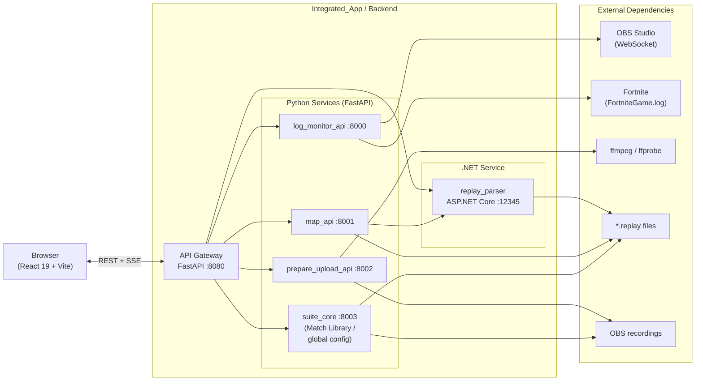
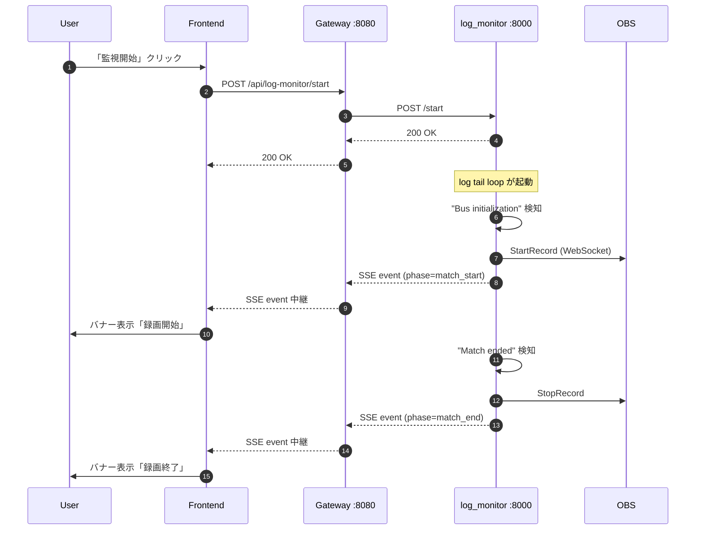
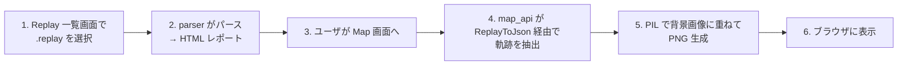
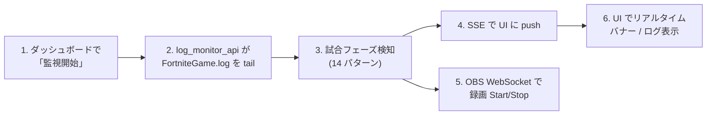
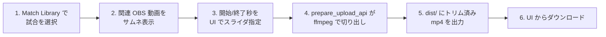

# 01. プロジェクト概要 (Overview)

> Fortnite Replay Suite – 統合 Web アプリの全体像と設計判断サマリ

---

## 1. はじめに

### 1.1 本ドキュメントの目的

本ドキュメントは、`Integrated_App/` で構築する **Fortnite Replay Suite** の全体像を俯瞰するためのエントリポイントである。
個別の詳細仕様（API、ゲートウェイ、フロントエンド、デプロイ、ディレクトリ構成）は別ドキュメントに分割しており、本書はそれらを横断する**地図**の役割を果たす。

### 1.2 想定読者

- 本プロジェクトに新規参画する開発者
- 既存 4 アプリのいずれかを保守してきた開発者（統合後の位置づけを把握したい）
- 将来サービスを追加する開発者（拡張ポイントの全体像が必要）

### 1.3 関連ドキュメント一覧

| # | ファイル | 内容 |
|---|---|---|
| 01 | **本書** | 全体像・設計判断サマリ |
| 02 | [02_existing_apps_analysis.md](./02_existing_apps_analysis.md) | 既存 4 アプリの構造・依存・統合論点 |
| 03 | [03_api_specification.md](./03_api_specification.md) | 6 サービスの REST/SSE エンドポイント定義 |
| 04 | [04_gateway_design.md](./04_gateway_design.md) | FastAPI 自作ゲートウェイの設計 |
| 05 | [05_frontend_design.md](./05_frontend_design.md) | React フロントエンド構成・画面・状態管理 |
| 06 | [06_deployment.md](./06_deployment.md) | 起動・停止・開発フロー（PowerShell + Python） |
| 07 | [07_project_structure.md](./07_project_structure.md) | モノレポのディレクトリ構成 |
| ‐ | [README.md](./README.md) | ドキュメント索引・実装フェーズ優先順位 |

---

## 2. プロジェクト背景

### 2.1 統合前の状況

`__Individual_Apps/` 配下に 4 つの独立したアプリが存在し、それぞれ別の起動方法・別の UI・別の依存環境を持っている。

| アプリ | 言語 / 技術 | UI 形態 | 主な役割 |
|---|---|---|---|
| `Fortnite_Replay_Parser_GUI` | C# / ASP.NET Core 9 | ブラウザ (port 12345) | `.replay` をパースして HTML レポート生成 |
| `fortnite_log_monitor` | Python 3.10+ CLI | ターミナル + 既存 React プロトタイプ (jsx) | `FortniteGame.log` 監視 → OBS 自動録画制御 |
| `Fortnite_replay_map_project` | Python + C# (subproc) | CLI (画像出力) | `.replay` の移動軌跡をマップ画像に投影 |
| `__prepare_upload` | Python CLI | ターミナル対話 | OBS 録画動画を ffmpeg でトリミング |

### 2.2 統合の動機

- **UI が分散** — それぞれ別画面・別操作体系で、ユーザの認知負荷が高い
- **起動の煩雑さ** — 4 アプリ別々に PowerShell を開く必要があり、依存セットアップも個別
- **機能の重複** — `Fortnite_Replay_Parser_GUI` と `Fortnite_replay_map_project/ReplayToJson` がいずれも `FortniteReplayReader 2.4.0` で `.replay` をパースしており、同じ処理が 2 箇所に存在
- **横断機能の不在** — 「OBS 録画動画」と「該当する `.replay` ファイル」を時刻でペアリングして「試合（Match）」として一覧する機能がどこにもない

### 2.3 ゴール

- **単一 Web UI** — ブラウザ 1 枚で 4 アプリすべての機能にアクセスできる
- **既存ロジックの温存** — 動作実績のある `.NET` パーサ・Python ロジックは書き換えず、API 化のみで取り込む
- **物理コピーで独立性維持** — `__Individual_Apps/` を読み取り専用リファレンスとして残し、`Integrated_App/services/` に物理コピーして編集する（参照アプリの破壊を防ぐ）
- **ワンコマンド起動** — `start.ps1` 一発で全サービスとフロントが立ち上がる
- **横断機能の追加** — Match Library（OBS 動画 × `.replay` の自動ペアリング）

### 2.4 非ゴール（やらないこと）

- **クラウド配信・パブリック公開** — ローカル単一マシン用途に限定
- **マルチユーザ・認証** — シングルユーザ前提（localhost バインド）
- **既存 .NET アプリの全面書き換え** — Minimal API はそのまま残し、エンドポイントを追加する形で拡張
- **モバイル対応** — デスクトップブラウザ専用

---

## 3. システム全体像

### 3.1 高レベル構成図



### 3.2 主要コンポーネント早見表

| コンポーネント | 種別 | ポート | 言語 | 主な責務 | 詳細 |
|---|---|---|---|---|---|
| **Frontend** | SPA | 5173 (dev) / 8080 配下 (prod) | TypeScript | UI・状態管理・SSE 受信 | [05](./05_frontend_design.md) |
| **API Gateway** | Reverse proxy | 8080 | Python (FastAPI) | ルーティング・SSE 中継・ヘルスチェック | [04](./04_gateway_design.md) |
| **replay_parser** | サービス | 12345 | C# (.NET 9) | `.replay` パース・HTML レポート・JSON エクスポート | [03 §2](./03_api_specification.md) |
| **log_monitor_api** | サービス | 8000 | Python | `FortniteGame.log` 監視・OBS 制御・phase push | [03 §3](./03_api_specification.md) |
| **map_api** | サービス | 8001 | Python | リプレイ → マップ画像投影 | [03 §4](./03_api_specification.md) |
| **prepare_upload_api** | サービス | 8002 | Python | ffmpeg 動画トリミング | [03 §5](./03_api_specification.md) |
| **suite_core** | サービス | 8003 | Python | Match Library・グローバル設定・横断機能 | [03 §6](./03_api_specification.md) |
| **OBS Studio** | 外部 | 4455 (WebSocket) | – | 録画制御 | – |
| **Fortnite** | 外部 | – | – | `FortniteGame.log` の生成元 | – |
| **ffmpeg / ffprobe** | 外部バイナリ | – | – | 動画長取得・トリミング | – |

### 3.3 データの流れ（代表例）



### 3.4 主要ユースケース 3 本の俯瞰

#### UC-1. リプレイをパースしてマップ画像を見る



#### UC-2. 試合中ログを監視して OBS 録画を自動制御



#### UC-3. 録画動画をトリミングしてアップロード準備



---

## 4. 設計判断サマリ（決定一覧）

過去の質問・回答で確定した主要な設計判断を一覧化する。詳細はリンク先を参照。

| # | 決定事項 | 概要 | 詳細リンク |
|---|---|---|---|
| D-01 | **モノレポ + 物理コピー方式** | `Integrated_App/` 単一リポジトリに 4 アプリを物理コピー。`__Individual_Apps/` は読み取り専用リファレンスとして残す | [07 §2-3](./07_project_structure.md) |
| D-02 | **FastAPI 自作ゲートウェイ** | nginx/Traefik ではなく FastAPI で自作（SSE 中継の柔軟性・Python 統一） | [04 §1](./04_gateway_design.md) |
| D-03 | **SSE による phase push** | WebSocket ではなく SSE（単方向で十分・ゲートウェイ実装が単純） | [04 §4](./04_gateway_design.md) / [03 §3.3](./03_api_specification.md) |
| D-04 | **snake_case API + camelCase 変換** | 新規 Python API は snake_case、フロントの fetcher 層で camelCase に変換。既存 .NET API の camelCase はそのまま | [03 §1.4](./03_api_specification.md) / [05 §6](./05_frontend_design.md) |
| D-05 | **PowerShell + Python ヘルパで起動** | `start.ps1` から Python プロセスマネージャを呼び、各サービスを spawn | [06 §2-3](./06_deployment.md) |
| D-06 | **System theme + override** | OS のダーク/ライトに追従、ユーザが明示切替も可能 | [05 §4.2](./05_frontend_design.md) |
| D-07 | **Match Library（横断機能）** | OBS 録画動画と `.replay` をタイムスタンプでペアリングし「試合」として一覧 | [03 §6](./03_api_specification.md) |
| D-08 | **グローバル player config** | 既存の `user_params.json`（プレイヤー名）を `~/.fortnite-suite/config.json` に昇格 | [07 §4](./07_project_structure.md) |
| D-09 | **ReplayToJson 重複の解消** | `Fortnite_replay_map_project/ReplayToJson.exe` の機能を `replay_parser` に JSON エクスポート endpoint として統合し、独立 exe は廃止 | [02 §6](./02_existing_apps_analysis.md) / [03 §2](./03_api_specification.md) |

---

## 5. 技術スタック総覧

### 5.1 Frontend

| 項目 | 採用技術 | バージョン目安 | 備考 |
|---|---|---|---|
| 言語 | TypeScript | 5.x | strict |
| フレームワーク | React | 19.x | Server Components は使わない |
| ビルド | Vite | 5.x | dev server / prod build 両方 |
| CSS | Tailwind CSS | v4 | utility-first |
| UI コンポーネント | shadcn/ui | – | Radix ベース |
| ルーティング | React Router | v6 | data router 構成 |
| 非同期データ | TanStack Query | v5 | サーバ状態のキャッシュ |
| リアルタイム | EventSource (SSE) | – | Context 経由で配信 |

### 5.2 Backend

| 項目 | 採用技術 | バージョン目安 |
|---|---|---|
| .NET | ASP.NET Core Minimal API | .NET 9 |
| Python | FastAPI + uvicorn | 3.10+ / FastAPI 0.110+ |
| HTTP クライアント | httpx | (Gateway 用) |

### 5.3 既存ライブラリ（温存）

| ライブラリ | 用途 | 使用サービス |
|---|---|---|
| FortniteReplayReader | `.replay` パース | replay_parser, map_api(統合後) |
| Scriban | HTML テンプレート | replay_parser |
| psutil | プロセス検知 | log_monitor_api |
| obsws-python | OBS WebSocket 制御 | log_monitor_api |
| Pillow (PIL) | マップ画像合成 | map_api |
| ffmpeg / ffprobe | 動画トリミング・尺取得 | prepare_upload_api |

### 5.4 通信プロトコル

| 用途 | プロトコル | 備考 |
|---|---|---|
| 一般 API | REST (JSON) | 全サービス |
| 状態 push | SSE (Server-Sent Events) | log_monitor のみ |
| ファイル取得 | HTTP GET (binary) | マップ画像・動画ダウンロード |
| OBS 制御 | OBS WebSocket | log_monitor → OBS |

### 5.5 ポート割り当て表

| ポート | サービス | 用途 |
|---|---|---|
| **5173** | Vite dev server | 開発時のみ |
| **8080** | API Gateway | フロントの唯一の宛先（prod では静的配信も兼ねる） |
| **8000** | log_monitor_api | 内部 |
| **8001** | map_api | 内部 |
| **8002** | prepare_upload_api | 内部 |
| **8003** | suite_core | 内部 |
| **12345** | replay_parser (.NET) | 内部（既存ハードコード値を温存） |
| **4455** | OBS WebSocket | 外部（OBS Studio） |

> Gateway 以外はすべて **127.0.0.1 バインド**。外部ネットワークからの直接アクセスを防ぐ。

---

## 6. ディレクトリ構成 早見

```
Integrated_App/
├── docs/                  # 本ドキュメント群
├── frontend/              # React 19 + Vite + Tailwind v4
├── gateway/               # FastAPI ゲートウェイ (port 8080)
├── services/
│   ├── replay_parser/     # 既存 .NET アプリの物理コピー
│   ├── log_monitor_api/   # 既存 Python ロジック + FastAPI ラッパ
│   ├── map_api/           # 既存 Python ロジック + FastAPI ラッパ
│   ├── prepare_upload_api/# 既存 Python ロジック + FastAPI ラッパ
│   ├── suite_core/        # 新規（Match Library / global config）
│   ├── _common/           # 共通モジュール（logging / config 読み込み）
│   └── requirements.txt   # Python 共通 venv 用
├── scripts/               # start.ps1 / stop.ps1 / dev.ps1 / process_manager.py
├── assets/                # マップ背景画像など
├── logs/                  # サービス別ログ（gitignore）
├── .run/                  # PID ファイル・ランタイム情報（gitignore）
├── .venv/                 # Python 共通仮想環境（gitignore）
└── dist/                  # フロント prod build / ffmpeg 出力（gitignore）
```

詳細は [07_project_structure.md](./07_project_structure.md) を参照。

---

## 7. 実装フェーズ計画（高レベル）

新規参画者が迷わないよう、実装の大まかな順序を示す。詳細な優先順位とチェックリストは [README.md](./README.md) を参照。

| Phase | 目的 | 主な成果物 |
|---|---|---|
| **Phase 0** | 基盤整備 | モノレポ作成・物理コピー・共通 venv・`start.ps1` 雛形・空 Gateway |
| **Phase 1** | 最初に動く UI | Gateway ↔ replay_parser 結線 / Replay 一覧画面 / HTML レポート表示 |
| **Phase 2** | リアルタイム機能 | log_monitor_api + SSE / ダッシュボードのライブバナー |
| **Phase 3** | マップ機能統合 | map_api 実装（ReplayToJson 統合含む）/ Map 画面 |
| **Phase 4** | 動画前処理 | prepare_upload_api / トリミング UI |
| **Phase 5** | 横断機能の仕上げ | suite_core / Match Library / 試合詳細画面 |

各 Phase は前の Phase が完了していなくても部分的に着手可能だが、依存順序に沿って進めるのが最短経路。

---

## 8. リスクと前提

### 8.1 Windows 専用前提

- **PowerShell 7+** が必要（`start.ps1` / `stop.ps1`）
- **Fortnite ログのパス**は Windows 固有: `%LOCALAPPDATA%/FortniteGame/Saved/Logs/FortniteGame.log`
- **OBS Studio Windows 版**を想定（macOS/Linux 版でも WebSocket 経由は同等動作するが未検証）

### 8.2 シングルユーザ前提

- **認証なし** — Gateway 含め全サービスを **127.0.0.1** にバインド
- **同時起動 1 セット** — `start.ps1` が二重起動を検知して拒否（PID ファイルで判定）

### 8.3 機密情報の取り扱い

- **OBS_PASSWORD** は `.env` に保持し、git 除外
- 既存 `__Individual_Apps/fortnite_log_monitor/.env` には実値が入っているため、物理コピー時に `.env.example` を生成して配布、実値は手動再投入する運用
- グローバル設定 `~/.fortnite-suite/config.json` も同様に git 管理外

### 8.4 既存 .NET アプリのバージョン追従リスク

- `FortniteReplayReader 2.4.0` は Fortnite 側のバイナリフォーマット変更で動作しなくなる可能性あり
- Fortnite アップデートのたびにパース結果の劣化を確認する運用が必要
- 致命的に壊れた場合のフォールバック設計（エラー画面で原因を表示し、`.replay` 自体はダウンロード可能にする）は Phase 1 で実装

---

## 9. 用語集

| 用語 | 定義 |
|---|---|
| **Replay** | Fortnite が出力する `.replay` ファイル。バイナリ形式の試合記録。 |
| **Match** | 1 つの試合を表す論理単位。`.replay` ファイルと OBS 録画動画の対応で構成される。Match Library が時刻でペアリング。 |
| **Phase** | 試合の進行段階。log_monitor が `FortniteGame.log` から検知する 14 パターン（match_start, match_end, eliminated 等）。 |
| **Match Library** | suite_core が提供する横断機能。`.replay` と OBS 動画を時刻ベースでペアリングし、Match の一覧と詳細を返す。 |
| **Suite Core** | 横断機能（Match Library・グローバル設定）を担う新規サービス。 |
| **Replay Parser** | 既存 `Fortnite_Replay_Parser_GUI` を統合した .NET サービス。`.replay` のパース・HTML レポート・JSON エクスポート。 |
| **Log Monitor** | 既存 `fortnite_log_monitor` を統合した Python サービス。`FortniteGame.log` 監視 + OBS 自動制御。 |
| **Prepare Upload** | 既存 `__prepare_upload.py` を統合した Python サービス。ffmpeg による動画トリミング。 |
| **Gateway** | フロントから見た唯一のバックエンド窓口（port 8080）。すべての REST/SSE を中継。 |
| **SSE** | Server-Sent Events。HTTP 上の単方向 push。log_monitor の phase 通知に使用。 |
| **`__Individual_Apps/`** | 統合前の 4 アプリのオリジナル。読み取り専用リファレンスとして温存し、編集しない。 |

---

> **Next:** 実装に着手する開発者は、まず [README.md](./README.md) のフェーズ別チェックリストを確認し、続いて担当サービスに対応する詳細仕様（02〜07）を読むこと。
