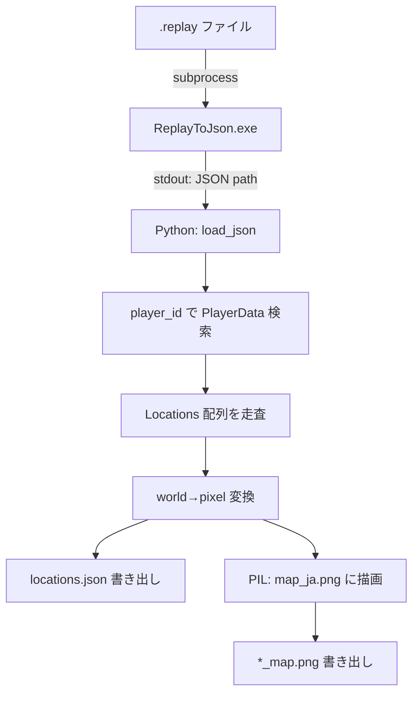
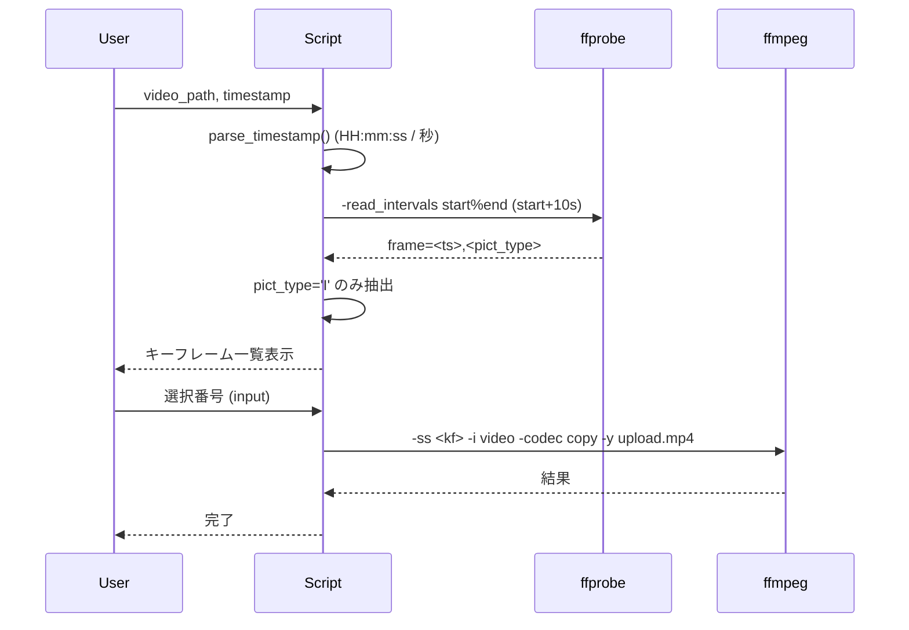
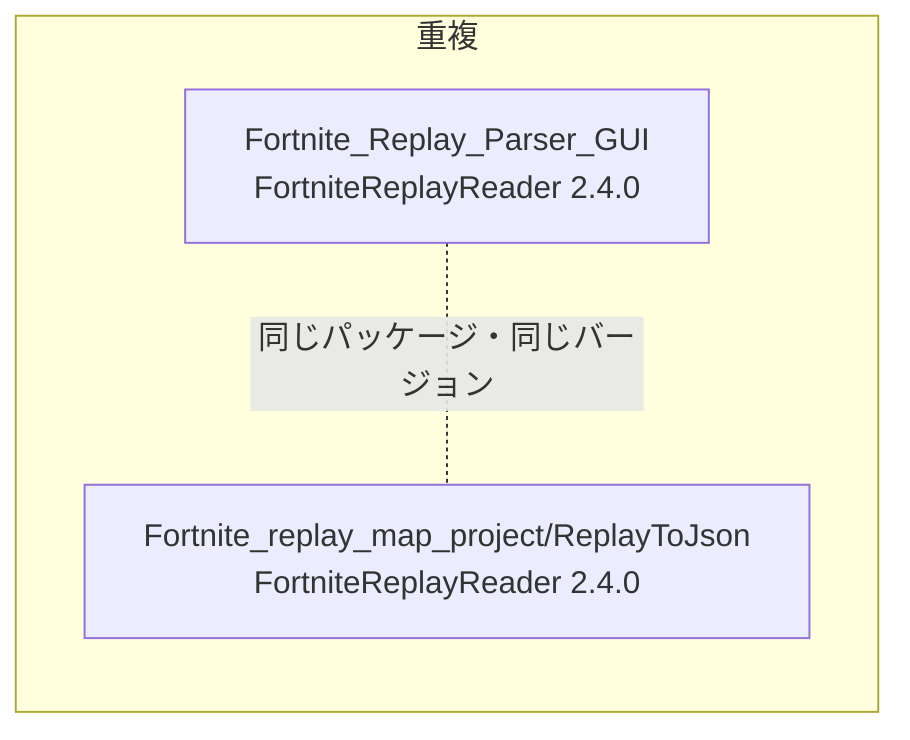
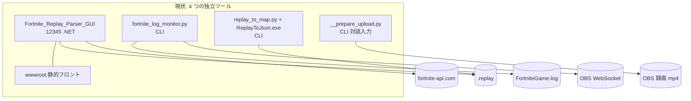
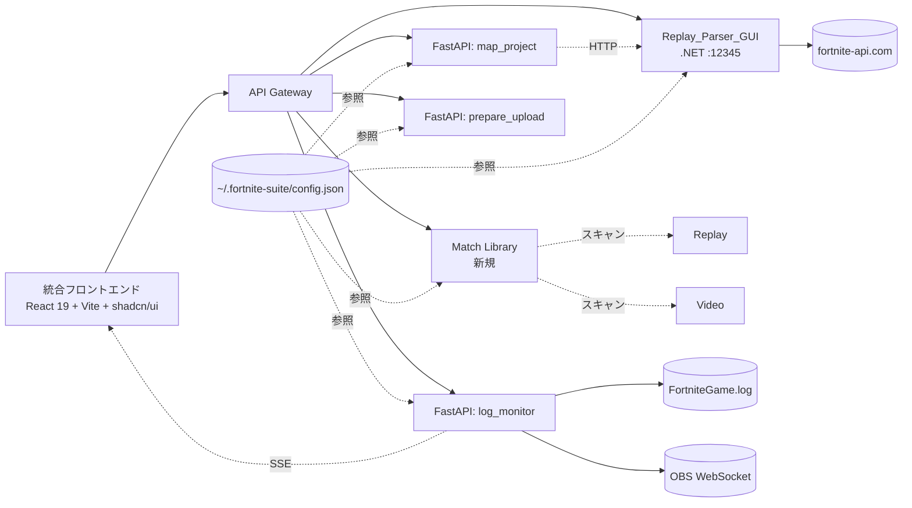

# 02. 既存アプリ分析

## 1. 概要

本ドキュメントは、統合対象である4つの既存アプリケーションを、ソースコードに基づき分析した結果をまとめたものである。各アプリの責務・技術スタック・入出力・外部依存・統合に向けた論点を整理し、後続の API 設計（`03_api_specification.md`）およびフロントエンド設計（`05_frontend_design.md`）の前提資料とすることを目的とする。

スコープ:
- ソースは `__Individual_Apps/` 配下の 4 ディレクトリ
- 動作検証は行わず、コードリーディングと付属 README から得られる情報のみを根拠とする
- 改修案・新設計は本ドキュメントでは「論点」として列挙するに留め、確定した設計は別ドキュメントに委ねる

---

## 2. Fortnite_Replay_Parser_GUI

### 2.1 役割と特徴

Fortnite の `.replay` バイナリファイルをパースし、ブラウザ UI 上で**マッチ統計（開始/終了時刻、プレイヤー一覧、キル時刻、コスメ名、システム情報）**を表示する Web アプリ。テンプレート（Scriban）で整形済みのテキスト出力を返す設計になっており、統合フロントから利用するには **構造化レスポンスの追加が前提**となる（後述 2.8）。

### 2.2 技術スタック

| 領域 | 採用技術 |
|---|---|
| ランタイム | .NET 9.0 (`Microsoft.NET.Sdk.Web`) |
| Web フレームワーク | ASP.NET Core Minimal API |
| リプレイパース | [`FortniteReplayReader`](https://github.com/Shiqan/FortniteReplayReader) v2.4.0 |
| JSON | `System.Text.Json` + `Newtonsoft.Json` 13.0.1 |
| テンプレート | `Scriban` v6.3.0 |
| HTTP クライアント | `System.Net.Http.HttpClient`（共有インスタンス） |
| 静的フロント | `wwwroot/` 配下の HTML + バニラ JS + CSS |
| テスト | `xUnit` v2.9.3 + `RichardSzalay.MockHttp` v7.0.0 |

参照: `__Individual_Apps/Fortnite_Replay_Parser_GUI/Fortnite_Replay_Parser_GUI.csproj`

### 2.3 起動方法とポート

```bash
dotnet publish
.\bin\Release\net9.0\publish\Fortnite_Replay_Parser_GUI.exe
```

`Program.cs:117` で **`http://localhost:12345` をハードコード**で `app.Run()` している。設定ファイル（`appsettings.json` 等）からの上書きは未実装。統合時はこのポート固定をどう扱うか論点（後述）。

### 2.4 既存 REST API 一覧

| # | Method | Path | 用途 |
|---|---|---|---|
| 1 | POST | `/api/upload` | `.replay` ファイルアップロード → セッション作成 + プレイヤー一覧返却 |
| 2 | POST | `/api/result` | 選択プレイヤー + 時刻オフセットでマッチ結果（テンプレート出力）返却 |
| 3 | GET | `/api/export/{sessionId}` | リプレイ全データの JSON ダウンロード |
| 4 | DELETE | `/api/session/{sessionId}` | セッション破棄（一時ファイル削除） |

#### 2.4.1 `POST /api/upload`

- リクエスト: `multipart/form-data`、フィールド名 `replayFile`
- レスポンス（200 OK）:
  ```json
  {
    "sessionId": "a1b2c3d4...",
    "players": [
      {
        "index": 0,
        "label": "PlayerName: PlayerId - human",
        "playerId": "ABC123",
        "playerName": "PlayerName",
        "isBot": false
      }
    ]
  }
  ```
- 内部処理: `Path.GetTempPath()` に GUID 名で保存 → `FortniteReplayHelper` インスタンス化 → `GetAllPlayersInReplay()` でプレイヤー抽出（NPC=`TeamIndex<3` 除外）→ `ConcurrentDictionary` に格納
- エラー: ファイル未指定で 400、パース失敗で 400 + `{ "error": "..." }`
- 参照: `Program.cs:22-64`

#### 2.4.2 `POST /api/result`

- リクエスト（JSON）:
  ```json
  {
    "sessionId": "a1b2c3d4...",
    "playerIndex": 0,
    "offset": 0
  }
  ```
- レスポンス（200 OK）:
  ```json
  { "result": "<Scriban テンプレートでレンダリングされたプレーンテキスト>" }
  ```
- レスポンスは構造化されておらず、整形済みのマッチ統計テキストが入る。`Templates/Template_MatchResult.cs` 内の `MatchStatTemplate` / `PlayerResultTemplate` / `SystemInfoTemplate` を順に展開
- エラー: セッション未存在で 404
- 参照: `Program.cs:67-86`、`FortniteReplayHelper.cs:157-308`

#### 2.4.3 `GET /api/export/{sessionId}`

- レスポンス: `application/json` の `replay.json`（添付ファイル）
- `FortniteReplay` オブジェクトを `WriteIndented = true` で全フィールドシリアライズ。**1試合あたり数十〜170MB 級**になることが実データから判明している（`Fortnite_replay_map_project/UnsavedReplay-2026.03.12-22.38.25.json` = 168MB）
- 参照: `Program.cs:89-105`

#### 2.4.4 `DELETE /api/session/{sessionId}`

- セッション辞書から削除し、`Path.GetTempPath()` 配下の `.replay` を削除
- 常に 200 OK（存在しないセッションでも）
- 参照: `Program.cs:108-115`

### 2.5 セッション管理の仕組み

- 実装: `var sessions = new ConcurrentDictionary<string, ReplaySession>();`（`Program.cs:19`）
- セッション ID: `Guid.NewGuid().ToString("N")`（32 文字、ハイフンなし）
- `ReplaySession` レコード: `(FortniteReplayHelper Helper, string TempFilePath)`
- **完全にインメモリ + プロセス揮発**。タイムアウト処理なし、再起動で消失、複数プロセス間共有不可
- 一時ファイルは `DELETE` 時のみ削除されるため、セッションを明示破棄しないと `%TEMP%` に残留する潜在リーク

### 2.6 外部依存

- **fortnite-api.com** (`FortniteApiClient.cs`)
  - エンドポイント: `https://fortnite-api.com/v2/cosmetics/br/search/ids?language={lang}&id={id}...`
  - 用途: コスメティック ID → 表示名の解決
  - タイムアウト 30 秒、リトライなし
  - エラー時は ID をそのまま返却（`FortniteReplayHelper.cs:146-151`）
  - 言語: マッチ統計本体は `en`、キル相手は `ja`（ハードコード混在）
- **PowerShell** (`SystemInfoHelper.cs`)
  - `Get-ComputerInfo` をバックグラウンド実行し OS/CPU/RAM/GPU/解像度を取得
  - Windows 専用、起動直後に非同期で初期化（`Program.cs:10`）

### 2.7 入出力データ

#### 入力
- `.replay` ファイル（Fortnite クライアントの既定保存先 `%LocalAppData%\FortniteGame\Saved\Demos\`）
- ファイル名規約: `UnsavedReplay-YYYY.MM.DD-HH.MM.SS.replay`（**マッチ開始時刻が含まれる** — Match Library ペアリングで利用可能）

#### 出力
- マッチ結果テキスト（テンプレート出力）
- リプレイ全データの JSON（`FortniteReplay` オブジェクトのフルダンプ）
- システム情報（テンプレート出力）

#### `FortniteReplay` JSON の主要構造（map_project が依存）
```
{
  "PlayerData": [
    {
      "PlayerId": "...",
      "PlayerName": "...",
      "IsBot": false,
      "TeamIndex": 3,
      "Placement": 7,
      "Cosmetics": { "Character": "..." },
      "Locations": [
        {
          "ReplicatedWorldTimeSecondsDouble": 100.366,
          "ReplicatedMovement": { "Location": { "X": ..., "Y": ..., "Z": ... } }
        }
      ]
    }
  ],
  "Eliminations": [
    { "Time": "mm:ss", "Eliminator": "...", "Eliminated": "...",
      "EliminatorInfo": { "Id": "..." }, "EliminatedInfo": { "Id": "..." } }
  ],
  "GameData": { "UtcTimeStartedMatch": "..." },
  "Info": { "LengthInMs": 1234567 }
}
```

### 2.8 統合に向けた論点

| # | 論点 | 想定解決方針 |
|---|---|---|
| L1 | レスポンスがプレーンテキスト（テンプレート出力）→ React/shadcn から扱いにくい | **構造化 JSON を返す新エンドポイント**（仮: `POST /api/result.json`）を追加 |
| L2 | `ReplayToJson.exe`（map_project 同梱）と完全に重複したパース処理を持つ | **サーバ間呼び出し用 `POST /api/replay-to-json` を追加**（body: ファイルパス、return: フル JSON）して map_project の `.exe` 起動を廃止 |
| L3 | `localhost:12345` がコード上ハードコード | gateway 経由のリバースプロキシで隠蔽。ポート自体は変更不要 |
| L4 | セッションの寿命管理がない | 統合フロントが DELETE を呼ぶ責務を持つ。バックグラウンド GC 追加は将来課題 |
| L5 | コスメ名 API のリトライ・キャッシュなし | 統合スコープ外（必要なら別途） |
| L6 | プレイヤー一覧の言語ハードコード（en/ja 混在） | 構造化エンドポイントでは ID を返し、表示文字列はフロント側で組み立てる方針 |

---

## 3. fortnite_log_monitor

### 3.1 役割と特徴

Fortnite の `FortniteGame.log` を `tail -f` 方式でリアルタイム監視し、ゲームフェーズの遷移をイベントとして検出する Python CLI スクリプト。検出時に**コンソール出力 / ビープ / Discord webhook / CSV 記録 / OBS リプレイバッファ保存**を実行できる。Fortnite クライアントの再起動・ログファイル削除に二重ループで自動追従する設計。

### 3.2 技術スタック

| 領域 | 採用技術 |
|---|---|
| ランタイム | Python 3.10+ |
| 標準ライブラリ | `re`, `argparse`, `csv`, `threading`, `dataclasses`, `pathlib`, `urllib.request` |
| プロセス検出 | `psutil`（任意、未インストールでもフォールバック動作） |
| OBS 連携 | `obsws-python`（`--obs` 指定時のみ） |
| ビープ | `winsound`（Windows のみ） |
| .env 読込み | 自前実装（`_load_env_file()`、軽量） |

### 3.3 起動方法と CLI オプション

```bash
python fortnite_log_monitor.py [options]
```

| オプション | 既定 | 用途 |
|---|---|---|
| `--log-path` | 自動検出 | `FortniteGame.log` パス |
| `--webhook` | なし | Discord Webhook URL |
| `--sound` | OFF | 重要イベント検出時に `winsound.Beep` |
| `--csv` | なし | イベントを CSV に追記 |
| `--verbose, -v` | OFF | 検出した原ログ行も表示 |
| `--scan-only` | OFF | 既存ログを一回スキャンのみ（リアルタイム監視しない） |
| `--poll-interval` | `0.5` | tail のポーリング間隔（秒） |
| `--obs` | OFF | OBS WebSocket 連携を有効化（`.env` から接続情報） |

参照: `fortnite_log_monitor.py:702-755`

### 3.4 イベント検出パターン

`EVENT_PATTERNS` リストに **14 種類**のパターンが定義されている（`fortnite_log_monitor.py:93-194`）。

| # | event_id | phase | 正規表現（要約） | ラベル |
|---|---|---|---|---|
| 1 | `game_launch` | launch | `^Log file open` | Fortnite 起動 |
| 2 | `lobby_enter` | lobby | `LoadMap:.*\/Game\/Maps\/Frontend` | ロビーに入った |
| 3 | `matchmaking_start` | matchmaking | `StartMatchmaking - Starting matchmaking to bucket` | マッチメイキング開始 |
| 4 | `session_found` | connecting | `MatchmakingLog:.*Succesfully Found Session` | サーバー発見 |
| 5 | `map_loaded` | loading | `LoadMap complete \/Hera_Map` | マップロード完了 |
| 6 | `phase_warmup` | warmup | `HandleGamePhaseChanged.*Setup.*Warmup` | ウォームアップ開始 |
| 7 | `phase_aircraft` | aircraft | `HandleGamePhaseChanged.*Warmup.*Aircraft` | バトルバス搭乗 |
| 8 | `bus_flying` | flying | `PhaseStep.*BusFlying` | バス発車 |
| 9 | `phase_safezones` | ingame | `HandleGamePhaseChanged.*Aircraft.*SafeZones` | 試合開始（降下可能） |
| 10 | `storm_forming` | ingame | `PhaseStep.*StormForming` | ストーム収縮開始 |
| 11 | `storm_holding` | ingame | `PhaseStep.*StormHolding` | ストーム停止 |
| 12 | `match_end` | post_match | `ClientSendEndBattleRoyaleMatchForPlayer` | 試合終了 |
| 13 | `return_lobby` | lobby | `FortPC::ReturnToMainMenu\(\)` | ロビーに戻った |
| 14 | `game_exit` | exit | `^Log file closed` | Fortnite 終了 |

追加抽出:
- `matchmaking_start`: `playlist_xxx` を抽出 → `extra="playlist: xxx"`
- `session_found`: `Session [Id: <hex>]` の先頭 12 文字を抽出

### 3.5 タイムスタンプ解析（UTC→JST）

ログ行頭の `[YYYY.MM.DD-HH.MM.SS:mmm]`（UTC）から、`+9 時間` のオフセットで JST に変換する2つのヘルパが定義されている（`parse_log_timestamp()`、`parse_log_datetime()`、`fortnite_log_monitor.py:211-242`）。

`scan_existing()` は **スクリプト起動時刻より前のエントリをスキップ**するために `parse_log_datetime()` を利用する（`fortnite_log_monitor.py:537-560`）。

論点: タイムゾーンが JST 固定（+9）になっており、海外利用や時刻変更には未対応。統合スコープ内では現状維持で問題なしと判断。

### 3.6 OBS 連携の仕様

#### 前提
- **OBS は常時リプレイバッファで録画している前提**
- スクリプトは `SaveReplayBuffer` を呼ぶだけで、録画の開始/停止はしない（`fortnite_log_monitor.py:266-267` 参照）

#### トリガー
| イベント | 動作 | 実装位置 |
|---|---|---|
| `phase_warmup` | **即座に `save_replay_buffer()`** | `_handle_obs()` `fortnite_log_monitor.py:381-383` |
| `return_lobby` | **`OBS_SAVE_DELAY` 秒後に保存**（既定 10 秒、Timer で遅延） | `schedule_save()` `fortnite_log_monitor.py:301-307` |

`schedule_save()` は既存タイマーを `cancel_save()` で破棄してから新タイマーを張るため、ロビー復帰が連続発火しても二重保存にはならない。

#### 接続情報（`.env`）
| キー | 既定 | 備考 |
|---|---|---|
| `OBS_HOST` | `localhost` | |
| `OBS_PORT` | `4455` | OBS WebSocket 既定 |
| `OBS_PASSWORD` | （空） | **実値が `.env` にコミットされている** — 統合時にも `.env` 配置で運用 |
| `OBS_SAVE_DELAY` | `10` | ロビー復帰検出から保存までの遅延（秒） |

### 3.7 コールバック層

`EventCallbacks` クラス（`fortnite_log_monitor.py:327-490`）が以下を提供:

| 機能 | 内容 |
|---|---|
| `_console_output()` | ANSI カラーコード付きでコンソール表示 |
| `_beep()` | Windows `winsound.Beep` で重要イベントのみ鳴らす（`matchmaking_start`, `phase_safezones`, `match_end`, `return_lobby`, `game_exit`） |
| `_send_discord()` | フェーズ別カラーで埋め込みメッセージを `urllib.request` で POST、タイムアウト 5 秒 |
| `_write_csv()` | `detected_at`, `log_timestamp`, `event_id`, `label`, `phase`, `extra`, `raw_line` の 7 カラム |
| `custom_callbacks` | 任意の関数リストを順次呼び出し（コードレベルの拡張点） |
| `_handle_obs()` | 上記 3.6 の制御 |

### 3.8 ログファイル自動検出と再起動耐性

#### 自動検出（`find_fortnite_log()` `fortnite_log_monitor.py:653-677`）
- Windows: `%LOCALAPPDATA%\FortniteGame\Saved\Logs\FortniteGame.log`
- macOS: `~/Library/Application Support/FortniteGame/Saved/Logs/FortniteGame.log`
- Wine: `~/.wine/drive_c/users/<user>/AppData/Local/...`

#### 二重ループ構造（`watch()` `fortnite_log_monitor.py:562-632`）
- 外側ループ: Fortnite プロセスの起動/終了サイクルに追従
- 内側ループ: `tail -f`（ファイル末尾から読み続ける）
- ファイルが**短くなった**場合 → `seek(0)` でリセット検出
- ファイルが**消えた**場合 → 内側ループを break し、外側に戻って再検出
- Fortnite プロセスが消えた場合 → 内側ループを break

→ **再帰呼び出しを使わない明示的な二重ループ**になっており、長時間運用に耐えるように設計されている。

### 3.9 既存 React JSX プロトタイプ

`__Individual_Apps/fortnite_log_monitor/fortnite_log_monitor.jsx`（25KB、`useState`/`useEffect`/`useRef`/`useCallback`）。

- **同じ `EVENT_PATTERNS` を JS で再定義**（パターン同期の維持コストあり）
- `PHASE_LABELS` などの UI 用ラベルを定義
- 統合フロントエンドのコンポーネント設計時に **そのまま React コンポーネントの土台として流用可能**（詳細は `05_frontend_design.md` で扱う）

### 3.10 統合に向けた論点

| # | 論点 | 想定解決方針 |
|---|---|---|
| L1 | CLI のため外部からの状態取得手段がない | **FastAPI ラッパー必須**。`status` / `events` エンドポイントを追加 |
| L2 | 監視ライフサイクル | 確定: **Fortnite プロセス検出で自動 ON/OFF**（CLI 既存挙動を踏襲）。フロント開始/停止 UI なし |
| L3 | リアルタイム push | **SSE (Server-Sent Events)** で現在 phase と最新イベントをフロントへ push。polling は採用しない |
| L4 | イベント履歴の永続化 | 確定: **メモリのみ**。サービス再起動で消えてよい |
| L5 | OBS 接続情報 | 確定: `.env` 固定、フロントから制御しない |
| L6 | EVENT_PATTERNS の二重定義（Python + JSX） | 統合後はバックエンド（Python）が source of truth。フロントは event_id/phase をそのまま受け取って表示マッピング |
| L7 | コールバック多様性（Discord, CSV, sound） | FastAPI 化後も内部は CLI と同じ `EventCallbacks` を再利用。CSV や sound はサーバ側ローカルファイル/音声、Discord は webhook URL を `.env` で固定 |

---

## 4. Fortnite_replay_map_project

### 4.1 役割と特徴

`.replay` ファイルから 1 プレイヤーの移動軌跡を抽出し、**マップ画像（2048×2048 PNG）に Z 値（高度）グラデーションでプロット**する Python ツール。リプレイのバイナリパースは C# サブプロジェクト `ReplayToJson` をサブプロセスとして起動し、JSON 化してから Python 側で扱う。

### 4.2 技術スタック

| 領域 | 採用技術 |
|---|---|
| Python 側 | Python 3.10+ / Pillow |
| C# サブプロジェクト | .NET 9 / `FortniteReplayReader` v2.4.0 |
| 連携方式 | `subprocess.run(["ReplayToJson.exe", <replay>])` で起動、stdout に出力 JSON のパスを取得 |

### 4.3 起動方法と CLI オプション

```bash
python replay_to_map.py <FN_REPLAY_FILE> \
  [--base-params base_params.json] \
  [--user-params user_params.json] \
  [--exe ReplayToJson/bin/Release/net9.0/ReplayToJson.exe]
```

| 引数 | 必須 | 既定 | 用途 |
|---|---|---|---|
| `FN_REPLAY_FILE` | ✓ | — | `.replay` または既に変換済みの `.json` |
| `--base-params` | — | `./base_params.json` | マップ画像 + 座標変換パラメータ |
| `--user-params` | — | `./user_params.json` | プレイヤー ID |
| `--exe` | — | `./ReplayToJson/bin/Release/net9.0/ReplayToJson.exe` | C# 変換ツールパス |

参照: `replay_to_map.py:17-38`

### 4.4 設定ファイル

#### `base_params.json`
```json
{
  "map_image": {
    "path": "map_ja.png",
    "width": 2048,
    "height": 2048
  },
  "world_to_pixel": {
    "scale_x": 0.00682888,
    "scale_y": 0.00673428,
    "world_origin_on_map": { "x": 964, "y": 1014 }
  }
}
```

変換式（`replay_to_map.py:118-122`）:
```
pixel_x = scale_x * world_x + world_origin_on_map.x
pixel_y = scale_y * world_y + world_origin_on_map.y
```

#### `user_params.json`
```json
{ "player_id": "YOUR_player_id or epic_id" }
```

→ **player_id 1 つだけ**。統合後はグローバル設定（`~/.fortnite-suite/config.json` 仮）に昇格 + フロントのドロップダウンで動的指定（5.x 参照）。

### 4.5 処理フロー



エントリポイント: `replay_to_map.py:60-90` (`main()`)

### 4.6 出力ファイルとサイズ目安

実データ（`Fortnite_replay_map_project/UnsavedReplay-2026.03.12-22.38.25.*`）からの実測:

| 出力ファイル | サイズ目安 | 内容 |
|---|---|---|
| `{stem}.json` | **~150MB** | リプレイ全データの JSON（`ReplayToJson.exe` の出力） |
| `{stem}_locations.json` | ~12〜18MB | フレームごとの `{ time, world(X,Y,Z), map(X,Y) }` の配列 |
| `{stem}_map.png` | ~2.7MB | 軌跡描画済みマップ画像 |

統合 API が PNG バイナリを直接返却する方針（B.4 確定）のもとでは、**中間 JSON はサーバ側のテンポラリ保存に留め、レスポンスには含めない**設計とする。

### 4.7 描画ルール

`replay_to_map.py:128-184`

- **色（Z 値グラデーション）**:
  - 青 (0,0,255) = `z_min`（地上付近）
  - 緑 (0,255,0) = `z_mean`
  - 赤 (255,0,0) = `z_max`（スカイダイブ等）
  - `z <= z_mean` は青→緑、`z > z_mean` は緑→赤の線形補間
- **点**: 通常 半径 1px（直径約 2px）、始点・終点のみ 半径 5px（直径約 10px）
- **線**: 隣接点を `width=1` で接続
- マップ画像のサイズが `base_params.json` と一致しない場合はエラー終了（`replay_to_map.py:153-159`）

### 4.8 統合に向けた論点

| # | 論点 | 想定解決方針 |
|---|---|---|
| L1 | `ReplayToJson.exe` が `Replay_Parser_GUI` とパースロジック重複 | 確定: **`Replay_Parser_GUI` 側に `POST /api/replay-to-json` を新設**、map サービスはそれを HTTP 経由で叩く。`ReplayToJson` プロジェクト自体は廃止候補 |
| L2 | `player_id` がファイル固定 | 確定: **グローバル設定 + フロントドロップダウン**（`/players` 取得 API + 選択 UI） |
| L3 | 巨大な中間 JSON のディスク書き出し | サーバ側で一時ファイル化 → 投影完了後に削除。レスポンスは PNG バイナリのみ |
| L4 | 出力（PNG）の返却方法 | 確定: **`Content-Type: image/png` で直接返却**。フロントは `` または `URL.createObjectURL` で表示 |
| L5 | マップ画像（`map_ja.png`）の管理 | サービスのリポジトリ内に同梱（バンドル）。差し替えは `base_params.json` の `path` で対応 |
| L6 | 処理時間（`.replay` パース＋PIL 描画） | 同期 API で十分か非同期ジョブ化が必要かは要計測。初版は **同期で実装し、タイムアウトを長め（60〜120 秒）** に設定する方針（`03_api_specification.md` で詳細化） |

---

## 5. __prepare_upload.py

### 5.1 役割と特徴

任意の動画ファイルから、指定タイムスタンプ近辺の **キーフレーム (I-frame) を `ffprobe` で列挙**し、ユーザに選ばせて、選択キーフレームから動画末尾までを **`ffmpeg -codec copy` で再エンコードなしに切り出して `upload.mp4` を出力**する単一ファイル CLI。

### 5.2 技術スタック

| 領域 | 採用技術 |
|---|---|
| ランタイム | Python 3 (標準ライブラリのみ) |
| 外部依存 | `ffprobe`, `ffmpeg`（PATH に通っていること） |

### 5.3 処理フロー



参照: `__prepare_upload.py:61-128`

### 5.4 細部仕様

- **キーフレーム検索範囲**: `start_seconds` から `start_seconds + 10` 秒（`__prepare_upload.py:29-58`）
- **タイムスタンプフォーマット**: `HH:MM:SS`, `MM:SS`, または秒（小数可）
- **対話入力**: `input("Select a keyframe [1-N]: ")`
- **出力ファイル**: `<video_path のディレクトリ>/upload.mp4`（**固定名**、上書き）
- **トリミング範囲**: 開始キーフレーム → **動画末尾**（終了時刻の指定はない）
- **エンコード**: `-codec copy`（再エンコードなし、高速・無劣化）

### 5.5 統合に向けた論点

| # | 論点 | 想定解決方針 |
|---|---|---|
| L1 | 対話入力（`input()`） | API 化に向けて **2 ステップ分割**: ① キーフレーム列挙 API、② 切り出し実行 API |
| L2 | 候補時刻の自動算出 | 確定: **動画 mtime（録画終了時刻）と Replay の試合長から、キル時刻（絶対時刻）に対応する動画内オフセット候補を算出**して提示。ユーザはそれを **秒単位で増減して微調整**できる UI |
| L3 | 終了時刻指定なし | 確定: **現状仕様のまま**（開始キーフレーム→末尾） |
| L4 | 出力ファイル名固定 (`upload.mp4`) | API では出力パス可変、または一時ファイル + ダウンロード方式に。デフォルトは入力動画と同フォルダの `upload.mp4` を踏襲 |
| L5 | `ffprobe` / `ffmpeg` の存在チェック | API 起動時のヘルスチェックで `which ffmpeg` を実行、未検出なら警告ログ + 機能無効化 |
| L6 | キーフレーム検索範囲 ±10 秒 | 候補時刻精度の確認後、必要に応じて拡張可能パラメータ化 |

---

## 6. 既存4アプリ間の関係まとめ

### 6.1 重複している処理



→ Replay→JSON 変換が 2 箇所に存在。確定方針として **`Replay_Parser_GUI` に集約**し、map サービスは HTTP 経由で利用する。

### 6.2 既存4アプリに「ない」もの（統合で新規追加が必要）

| 項目 | 必要性 | 配置案 |
|---|---|---|
| Match Library（OBS 動画 + Replay のペアリング） | ダッシュボード「直近の試合一覧」のため必須 | 新規サービスまたは Gateway 内のロジック |
| グローバル設定（自分の player_id、Demos パス、OBS 録画パス） | 全サービスから参照される | `~/.fortnite-suite/config.json`（仮） |
| リアルタイム phase push | フロント現在ステータス表示のため | log_monitor サービス内に SSE エンドポイント |
| OBS 録画フォルダ自動取得 | Match Library のため | OBS WebSocket `GetRecordDirectory` を起動時に試行 → 失敗時は config |
| キル時刻の集計（直近 N 試合） | ダッシュボード集計のため | log_monitor サービスの `events` または別途 SQLite。確定方針は **セッション中のメモリのみ** |

### 6.3 統合後に共有が必要な状態

| 状態 | 共有元 | 利用先 |
|---|---|---|
| `user_player_id` | グローバル設定 | Parser_GUI（既定プレイヤー）、Map サービス、Dashboard |
| Demos フォルダパス | グローバル設定 or 既定値 | Match Library、Parser_GUI（リプレイ一覧表示） |
| OBS 録画フォルダパス | OBS WebSocket → グローバル設定フォールバック | Match Library |
| 現在の Fortnite phase | log_monitor SSE | Dashboard（リアルタイム表示） |
| 直近イベント / 集計 | log_monitor メモリ | Dashboard |

---

## 7. アーキテクチャ俯瞰（既存 vs 統合後プレビュー）

### 7.1 現状（独立構成）



### 7.2 統合後（プレビュー — 詳細は `01_overview.md` で確定）



統合の最重要ポイント:
1. ReplayToJson.exe を廃止し、**Replay_Parser_GUI に集約**
2. log_monitor は **SSE で push**
3. **Match Library** を新規追加（OBS 動画と Replay をペアリング）
4. **グローバル設定** で player_id 等を共有

---

（本ドキュメントここまで）
