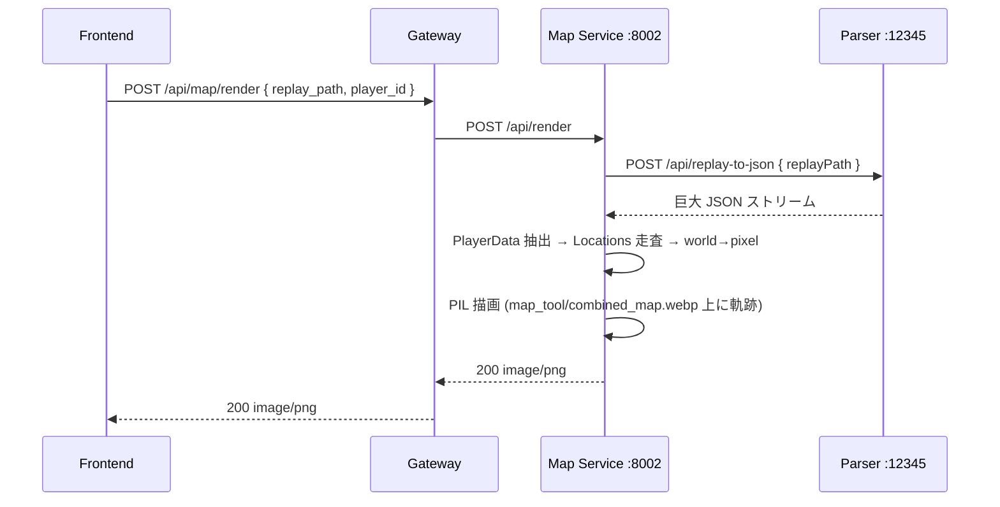
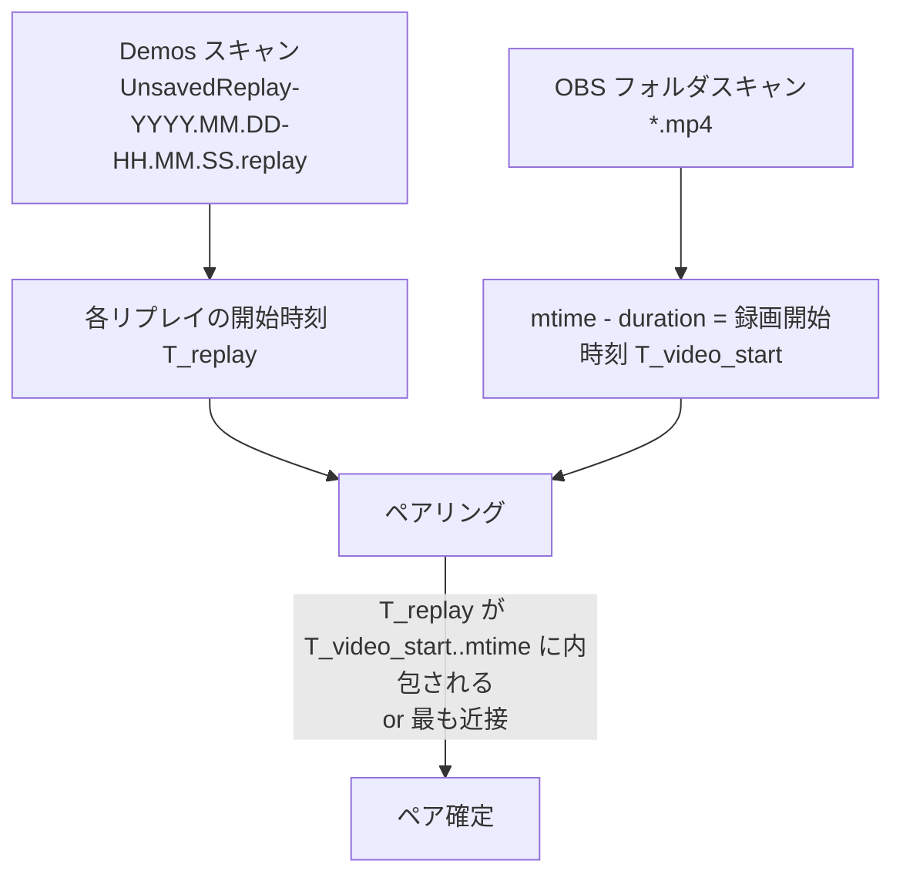
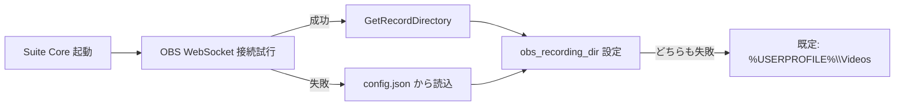
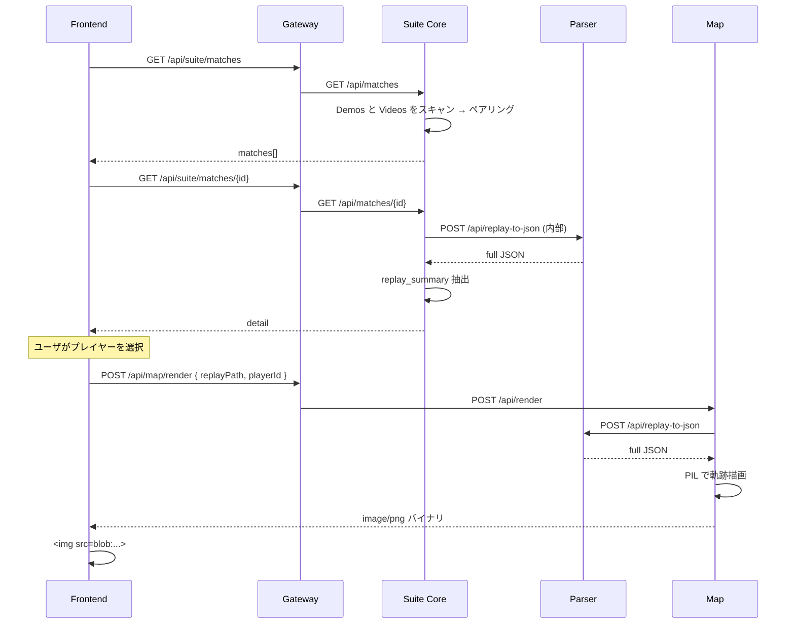
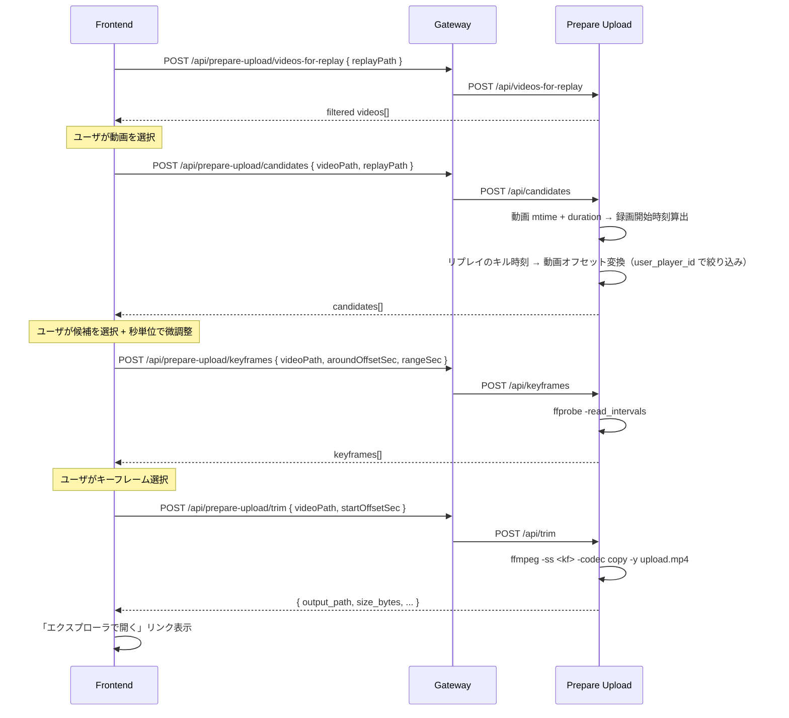

# 03. API 仕様

## 1. 概要・スコープ

本ドキュメントは統合後のすべての REST / SSE エンドポイントを一元的に定義する。対象は以下の 5 サービス + Gateway。

- Replay Parser（既存 .NET、エンドポイント追加）
- Log Monitor（新規 FastAPI ラッパー）
- Map（新規 FastAPI ラッパー）
- Prepare Upload（新規 FastAPI ラッパー）
- Suite Core（新規、Match Library + グローバル設定）
- API Gateway（束ね役、詳細は `04_gateway_design.md`）

前提:
- Windows ローカル運用、個人用、**認証なし**
- 全サービスは `127.0.0.1` バインド（外部ネットワークからアクセスさせない）
- フロントは Gateway 経由で同一オリジン化される
- 詳細な分析の前提は `02_existing_apps_analysis.md` を参照

---

## 2. サービス構成とポート割り当て

### 2.1 サービス一覧

> 単一の真実源は [`services/_common/ports.py`](../services/_common/ports.py)。ドキュメントと食い違いが発生した場合はそちらを優先し、本節を訂正する。

| # | サービス | ポート | 実装言語 | 役割 |
|---|---|---|---|---|
| 1 | Replay Parser | **12345** | C# / .NET 9 | `.replay` パース、構造化結果、JSON エクスポート |
| 2 | Log Monitor | **8000** | Python / FastAPI | ログ監視、phase/イベント push、OBS 制御 |
| 3 | Map | **8001** | Python / FastAPI | マップ画像へ移動軌跡を投影 |
| 4 | Prepare Upload | **8002** | Python / FastAPI | 動画キーフレーム検出 + トリム |
| 5 | Suite Core | **8003** | Python / FastAPI | Match Library + グローバル設定 |
| 6 | API Gateway | **8080** | Python / FastAPI（`04` 参照） | フロント配信 + リバースプロキシ |

### 2.2 ポート選定の根拠

- **12345**: 既存 Parser の固定ポート（`Program.cs:117`）。ハードコードされており変更には .NET 側コード修正が必要なため温存
- **8000–8003**: 連番で識別しやすい範囲。よく使われる開発ポート（3000, 5173 等）と衝突しない値を選択
- **8080**: API Gateway の慣例ポート、ブラウザでも特権なしで bind 可
- Vite dev サーバの 5173 は開発時のみ使用、本番は Gateway が静的ファイル配信

衝突回避: いずれも IANA 登録範囲外、Windows でよく使われるポート（135, 445, 3389 等）と非干渉。

---

## 3. 共通仕様

### 3.1 エラーレスポンス形式

新規エンドポイント（FastAPI 側 + .NET 新規分）は以下の標準形式に揃える。

```json
{
  "error": "human-readable message in Japanese",
  "code": "RESOURCE_NOT_FOUND",
  "detail": { "additional": "context" }
}
```

| HTTP Status | code 例 | 用途 |
|---|---|---|
| 400 | `INVALID_REQUEST` | バリデーション失敗、必須パラメータ欠落 |
| 404 | `RESOURCE_NOT_FOUND` | セッション・ファイル・マッチ未発見 |
| 409 | `CONFLICT` | 設定 PUT で楽観ロック失敗（将来用） |
| 422 | `UNPROCESSABLE` | パース失敗、ffmpeg/ffprobe エラー |
| 500 | `INTERNAL_ERROR` | 想定外例外 |
| 503 | `UPSTREAM_UNAVAILABLE` | Parser Service への内部呼び出し失敗等 |

既存 Parser の 4 エンドポイントは `{ "error": "..." }` 形式を維持（互換性のため）。

### 3.2 命名規則

- パス: `/api/<resource>` または `/api/<resource>/<action>`
- リソースは複数形（例: `/api/matches`, `/api/players`）、アクションはスネーク（`/api/replay-to-json` のようなケバブも許容）
- パスパラメータ: スネーク（`{session_id}`）
- 既存 Parser の `/api/upload` `/api/result` 等は変更せず温存

### 3.3 CORS 方針

- **各バックエンドサービスは CORS 無効** で起動
- ブラウザからのアクセスは **すべて Gateway (`:8080`) 経由**で同一オリジン化
- 開発時のみ Vite dev (`:5173`) → Gateway へのプロキシを Vite 側で設定（詳細は `05_frontend_design.md`）
- 各サービスは `127.0.0.1` バインドにより外部公開を防ぐ

### 3.4 文字エンコーディング・タイムゾーン

- 全レスポンス: `UTF-8`（既存 .NET も `JavaScriptEncoder.Create(UnicodeRanges.All)` 使用）
- 時刻表現:
  - 設定・API レスポンスのタイムスタンプ: **ISO 8601 文字列、JST**（例: `"2026-03-21T19:35:42+09:00"`）
  - 既存 Parser の `mm:ss` 形式（マッチ内経過時間）はそのまま温存
  - Log Monitor は内部で UTC→JST 変換済み（`02_existing_apps_analysis.md` §3.5 参照）

### 3.5 ジョブ管理方式の選定方針

| 処理特性 | 選択 | 適用箇所 |
|---|---|---|
| 即時応答（< 1 秒） | 同期 REST | 設定 GET/PUT、リプレイ player 一覧、status |
| 中時間（1〜10 秒） | 同期 REST + クライアント側ローディング表示 | キーフレーム列挙、構造化マッチ結果 |
| 長時間（10〜120 秒） | **同期 REST + サーバ/クライアントタイムアウトを長め** | マップ投影 (`/api/render`)、トリミング (`/api/trim`) |
| 連続イベント push | **SSE** | Log Monitor の `phase_change`, `event_detected` |

**判断基準**: 個人ローカル運用のため WebSocket やジョブキューの導入は過剰。長時間処理は同期 + 長めのタイムアウト + フロントでのキャンセル可で十分。WebSocket よりも SSE のほうが片方向 push に十分でかつ HTTP 経路で gateway を素直に通せる。

### 3.6 SSE 共通フォーマット

`text/event-stream` で以下のイベントを流す:

```
event: phase_change
data: {"phase":"ingame","label":"試合開始（降下可能）","at":"2026-03-21T19:35:42+09:00"}

event: event_detected
data: {"event_id":"phase_warmup","label":"ウォームアップ開始","phase":"warmup","timestamp":"19:35:00","detected_at":"19:35:01","extra":null,"raw_line":"..."}

event: monitor_state
data: {"running":true,"fortnite_running":true,"log_path":"C:\\Users\\..."}
```

- 接続維持のため 30 秒ごとに `: keepalive` コメント行を送る
- クライアント (`EventSource`) は自動再接続をデフォルト動作で利用

---

## 4. Replay Parser Service (`:12345`)

> **実装ノート (2026-04):** 既存 4 endpoints (`/api/upload`, `/api/result`, `/api/export/{sessionId}`, `/api/session/{sessionId}`) は camelCase を温存している。統合フロントは `/api/upload` + `/api/result` を引き続き用いており、当初想定していた `/api/result.json`（§4.2）と `/api/upload-from-path`（§4.4）は **現時点では未実装**（将来検討）。


### 4.1 既存エンドポイント（変更なし）

| Method | Path | 用途 | 詳細 |
|---|---|---|---|
| POST | `/api/upload` | `.replay` アップロード → `sessionId` + プレイヤー一覧 | `02` §2.4.1 |
| POST | `/api/result` | プレーンテキストのマッチ結果 | `02` §2.4.2 |
| GET | `/api/export/{sessionId}` | リプレイ全データ JSON ダウンロード | `02` §2.4.3 |
| DELETE | `/api/session/{sessionId}` | セッション破棄 | `02` §2.4.4 |

統合フロントからは `/api/result` は使わず、後述の `/api/result.json` を利用する。

### 4.2 新規: `POST /api/result.json`

構造化版マッチ結果。shadcn の Card / Table で利用しやすい JSON を返す。

**リクエスト** (`application/json`):
```json
{
  "sessionId": "a1b2c3d4...",
  "playerIndex": 0,
  "offset": 0
}
```

**レスポンス** (200 OK):
```json
{
  "match": {
    "started_at": "2026-03-21T19:35:42+09:00",
    "ended_at":   "2026-03-21T19:54:18+09:00",
    "duration_ms": 1116000,
    "duration_label": "18:36"
  },
  "participants": {
    "total": 100,
    "human": 87,
    "bot": 13
  },
  "player": {
    "player_id": "ABC123...",
    "player_name": "FooPlayer",
    "is_bot": false,
    "cosmetics_id": "Character_Foo",
    "cosmetics_name": "ふぉーくん",
    "placement": 7,
    "last_location": { "x": 12345.6, "y": -7890.1, "z": 4500.0 }
  },
  "eliminations": [
    {
      "index": 1,
      "time": "03:42",
      "time_offset_applied": "03:44",
      "victim": {
        "player_id": "XYZ789...",
        "player_name": "BarPlayer",
        "is_bot": false,
        "cosmetics_id": "Character_Bar",
        "cosmetics_name": "ばーくん"
      }
    }
  ],
  "eliminated_by": {
    "time": "15:21",
    "time_offset_applied": "15:23",
    "killer": {
      "player_id": "DEF456...",
      "player_name": "BazPlayer",
      "is_bot": false,
      "cosmetics_id": "Character_Baz",
      "cosmetics_name": "ばずくん"
    }
  },
  "system_info": {
    "os": "Windows 11 Pro 26200",
    "cpu": "Intel ...",
    "memory_gb": 32,
    "available_memory_gb": 18.4,
    "gpu": "NVIDIA RTX ...",
    "resolution": "2560x1440"
  }
}
```

**実装メモ**:
- 既存 `RenderMatchResultFromTemplate` の内部処理（`FortniteReplayHelper.cs:157-308`）を **テンプレートに通す前のモデルオブジェクト**でそのまま JSON 化するイメージ
- `eliminated_by` はプレイヤーが倒されていない場合 `null`
- キー命名は **snake_case で統一**（既存 4 endpoints とは別系統）

**エラー**:
- 404 `RESOURCE_NOT_FOUND`: `sessionId` 未存在
- 400 `INVALID_REQUEST`: `playerIndex` が範囲外（マイナス値や `players.length` 以上）

### 4.3 新規: `POST /api/replay-to-json`

サーバ間呼び出し用。Map サービスや Match Library から **ファイルパス指定でパース結果を取得**するために使う。`upload` のような multipart や session 管理を介さない。

**リクエスト**:
```json
{ "replay_path": "C:\\Users\\xxx\\AppData\\Local\\FortniteGame\\Saved\\Demos\\UnsavedReplay-2026.03.21-19.35.42.replay" }
```

**レスポンス** (200 OK):
- `Content-Type: application/json`
- ボディは `FortniteReplay` オブジェクトのフルダンプ（`02` §2.7 参照、最大 ~170MB）
- 以下のヘッダを付与:
  - `X-Replay-Player-Count: 100`
  - `X-Replay-Length-Ms: 1116000`

**エラー**:
- 400 `INVALID_REQUEST`: `replay_path` 未指定 / 拡張子不一致
- 404 `RESOURCE_NOT_FOUND`: ファイル未存在
- 422 `UNPROCESSABLE`: パース失敗

**設計メモ**:
- 副作用なし（セッション登録しない、テンポラリファイル不使用）
- レスポンスサイズが巨大なので、**ストリーミング書き出し**（`Results.Stream` / `Response.WriteAsync`）で実装してメモリ滞在量を抑える
- セキュリティ: パスは絶対パスのみ受け付け、`%LOCALAPPDATA%` 配下と Suite Core の Demos 設定値の配下のみ許可（パストラバーサル対策）

### 4.4 新規: `POST /api/upload-from-path`

Match Library 経由で「既知のファイルパスから sessionId を取りたい」場合用。ブラウザの multipart アップロードを介さない。

**リクエスト**:
```json
{ "replay_path": "C:\\...\\UnsavedReplay-2026.03.21-19.35.42.replay" }
```

**レスポンス** (200 OK):
```json
{
  "sessionId": "a1b2c3d4...",
  "players": [ ... 既存 /api/upload と同形式 ... ]
}
```

**実装メモ**:
- 内部処理は既存 `/api/upload` と同じ。Tempコピーをスキップし、与えられたパスを直接 `FortniteReplayHelper` に渡す
- 既存 `/api/upload` と異なり、セッション破棄時に元ファイルは削除しない（Demos の実体ファイルを誤削除しないため）
- `ReplaySession` レコードに「外部参照フラグ」を追加するか、別ディクショナリで管理する案あり（実装時に判断）

---

## 5. Log Monitor Service (`:8000`)

### 5.1 GET `/api/status`

現在の監視状態を返す。

**レスポンス**:
```json
{
  "running": true,
  "fortnite_running": true,
  "log_path": "C:\\Users\\xxx\\AppData\\Local\\FortniteGame\\Saved\\Logs\\FortniteGame.log",
  "current_phase": "ingame",
  "match_count": 3,
  "last_event": {
    "event_id": "phase_safezones",
    "label": "試合開始（降下可能）",
    "phase": "ingame",
    "timestamp": "19:35:42",
    "detected_at": "19:35:43",
    "extra": null
  },
  "obs_connected": true,
  "session_started_at": "2026-03-21T19:00:00+09:00"
}
```

### 5.2 GET `/api/events`

セッション中（サービス起動以降）に検出された全イベント。

**クエリパラメータ**:
- `since` (optional, ISO 8601): 指定時刻以降のみ
- `limit` (optional, default 200): 最大件数（新しい順）

**レスポンス**:
```json
{
  "count": 42,
  "events": [
    {
      "event_id": "phase_warmup",
      "label": "ウォームアップ開始",
      "icon": "⏳",
      "phase": "warmup",
      "timestamp": "19:34:55",
      "detected_at": "19:34:56",
      "extra": null,
      "raw_line": "..."
    }
  ]
}
```

### 5.3 GET `/api/aggregate`

セッション中の集計（直近 N 試合）。

**クエリパラメータ**:
- `last_n` (optional, default 10): 直近何試合分か

**レスポンス**:
```json
{
  "session_started_at": "2026-03-21T19:00:00+09:00",
  "match_count": 7,
  "matches_aggregated": 7,
  "totals": {
    "matches_played": 7,
    "matches_completed": 6,
    "average_duration_sec": 1043
  },
  "per_match_phases": [
    {
      "match_index": 1,
      "matchmaking_at": "19:05:12",
      "match_started_at": "19:08:33",
      "match_ended_at": "19:24:01",
      "duration_sec": 928
    }
  ]
}
```

**実装メモ**:
- ログ監視サービス自体は**キル数や順位を持たない**（リプレイにしか入っていない情報）
- フロントの「直近のキル数・順位の集計」は **Suite Core の Match Library 経由でリプレイをパースして集計**する
- 本エンドポイントは「**セッション中の試合数・所要時間など、ログから取れる集計**」に限定

### 5.4 GET `/api/stream` (SSE)

`text/event-stream` で push。フォーマットは `§3.6` 参照。

**event 種別**:
| event 名 | data |
|---|---|
| `phase_change` | `{ phase, label, at }` |
| `event_detected` | `DetectedEvent` 全フィールド（`02` §3.4 のテーブル準拠） |
| `monitor_state` | `{ running, fortnite_running, log_path, obs_connected }` |
| `keepalive` | （コメント行のみ、30 秒間隔） |

**接続例**:
```
GET /api/stream HTTP/1.1
Accept: text/event-stream
```

サーバ側はリングバッファ（最大 200 件）に直近イベントを保持し、新規接続時に `event: backlog` で送信してから live ストリームを開始する。

### 5.5 イベント ID カタログ

`event_detected` の `event_id` フィールドに入りうる値の一覧。`cooldown_sec > 0` のイベントは、同一 ID の前回発火から指定秒が経過するまで再発火を抑制する。

| event_id | アイコン | label | phase | extra | cooldown_sec |
|---|---|---|---|---|---|
| `game_launch` | 🚀 | Fortnite 起動 | launch | — | 0 |
| `lobby_enter` | 🏠 | ロビーに入った | lobby | — | 0 |
| `matchmaking_start` | 🔍 | マッチメイキング開始 | matchmaking | プレイリスト名 | 0 |
| `session_found` | 🎯 | サーバー発見 | connecting | セッション ID 先頭 12 文字 | 0 |
| `map_loaded` | 🗺️ | マップロード完了 | loading | — | 0 |
| `phase_warmup` | ⏳ | ウォームアップ開始 | warmup | — | 0 |
| `phase_aircraft` | 🚌 | バトルバス搭乗 | aircraft | — | 0 |
| `bus_flying` | ✈️ | バス発車 | flying | — | 0 |
| `phase_safezones` | ⚔️ | 試合開始（降下可能） | ingame | — | 0 |
| `storm_forming` | 🌀 | ストーム収縮開始 | ingame | — | 0 |
| `storm_holding` | 🌀 | ストーム停止 | ingame | — | 0 |
| `player_kill` | 💥 | キル！ | ingame | — | 0 |
| `player_death` | 💀 | 死亡 | ingame | キルしたプレイヤー名 | 0 |
| `victory_royale` | 👑 | Victory Royale！ | post_match | — | 60.0 |
| `match_end` | 🏁 | 試合終了 | post_match | — | 0 |
| `return_lobby` | 🔙 | ロビーに戻った | lobby | — | 0 |
| `game_exit` | ⏹️ | Fortnite 終了 | exit | — | 0 |

**cooldown の実装詳細**: `FortniteLogMonitor._detect_event()` 内で `_last_fired: dict[str, datetime]` を参照し、`(now - last_fired[event_id]).total_seconds() < cooldown_sec` の場合は `None` を返してイベント発火を抑制する。クールダウン対象は現時点で `victory_royale` のみ（`GetLocalPlayerHasWinningPlacement 1` がポストゲーム画面で連続して出力される場合に重複通知を防ぐ目的）。

### 5.5 ライフサイクル

確定方針（`02` §3.10 L2）:
- **サービス起動 = 監視ループ起動**（`FortniteLogMonitor.watch()` を別スレッドで開始）
- フロントから start/stop の API は提供しない
- 内部では既存 CLI と同じく Fortnite プロセス検出→自動 ON/OFF

例外: 開発デバッグ用に `POST /api/_debug/restart` を**任意**で追加（本番運用では呼ばない）。

---

## 6. Map Service (`:8001`)

### 6.1 GET `/api/players`

リプレイファイルからプレイヤー一覧を取得（ドロップダウン用）。内部で Replay Parser の `/api/replay-to-json` を呼ぶ。

**クエリパラメータ**:
- `replay_path` (required)

**レスポンス**:
```json
{
  "replay_path": "C:\\...\\UnsavedReplay-...",
  "players": [
    {
      "player_id": "ABC123...",
      "player_name": "FooPlayer",
      "is_bot": false,
      "team_index": 3
    }
  ]
}
```

**注**: NPC（`team_index < 3`）は Parser が既に除外している。

### 6.2 POST `/api/render`

マップに移動軌跡を投影し、PNG バイナリを返す。

**リクエスト**:
```json
{
  "replay_path": "C:\\...\\UnsavedReplay-...",
  "player_id": "ABC123..."
}
```

**レスポンス**:
- `Content-Type: image/png`
- ボディは PNG バイナリ（~3MB）
- 以下のヘッダを付与:
  - `X-Map-Z-Min: -1234.5`
  - `X-Map-Z-Mean: 5678.0`
  - `X-Map-Z-Max: 79850.0`
  - `X-Map-Point-Count: 1834`

**エラー**:
- 400 `INVALID_REQUEST`: パラメータ不備
- 404 `RESOURCE_NOT_FOUND`: replay_path 未存在 / player_id がリプレイ内に不在
- 422 `UNPROCESSABLE`: パース失敗・画像生成失敗
- 503 `UPSTREAM_UNAVAILABLE`: Parser Service へ届かない

**タイムアウト**:
- サーバ側: 120 秒
- Gateway: 130 秒（バッファ）
- フロント: 150 秒 + キャンセルボタン

### 6.3 内部処理シーケンス



**実装メモ**:
- 既存 `replay_to_map.py` の `build_location_entries()` / `draw_route()` をそのまま流用、I/O 層だけ HTTP 化
- `base_params.json` はサービスのリポジトリ内に同梱
- 背景マップ画像は `services/map_api/map_tool/combined_map.webp`。`map_tool/download_and_combine.js`（Node.js 20+）が fortnite.gg からタイルを取得して合成する。`map_api` は起動時にバージョン差分を検知した場合のみ再ビルドを fire-and-forget する
- レスポンスは `BytesIO` 経由で生成し、ディスク書き出しを行わない

### 6.4 新規: `GET /api/map-version`

現在ローカルに保持しているマップバージョン文字列（`map_tool/.map_version`）を返す。未更新時は `null`。

```json
{ "version": "v34.10" }
```

### 6.5 新規: `POST /api/map/update`

背景マップを手動で更新。内部で `node map_tool/download_and_combine.js` を実行し、新しいタイルが取得できれば `combined_map.webp` を上書きする。同時実行は内部 Lock で直列化。

**レスポンス** (200 OK):
```json
{
  "updated": true,
  "version": "v34.12",
  "prev_version": "v34.10",
  "stdout_tail": [ "... 最新 20 行 ..." ]
}
```

**エラー**: 503 `UPSTREAM_UNAVAILABLE`（Node.js 未導入 / fortnite.gg 到達不可 / スクリプトタイムアウト 120 秒）

---

## 7. Prepare Upload Service (`:8002`)

### 7.1 POST `/api/candidates`

動画ファイルとリプレイから「キル時刻に対応する動画内オフセット候補」を算出。

**リクエスト** (camelCase):
```json
{
  "videoPath": "C:\\Users\\xxx\\Videos\\replay 2026-03-21 19-54-30.mp4",
  "replayPath": "C:\\...\\UnsavedReplay-2026.03.21-19.35.42.replay"
}
```

**処理**:
1. 動画の **mtime（最終更新時刻 = 録画終了時刻）** を取得
2. 動画の長さ（duration）を `ffprobe -show_format` で取得
3. → 動画の**録画開始時刻** = `mtime - duration`
4. リプレイから `started_at` (`UtcTimeStartedMatch` を JST 化) と `eliminations[].time` を取得
5. キル時刻（絶対）= `started_at + eliminations[i].time`
6. 動画内オフセット = `(キル時刻 - 録画開始時刻).total_seconds()`
7. 範囲 `[0, duration]` に収まる候補のみ返す
8. **ユーザ絞り込み**: `config.player.epic_display_name`（= `user_player_id`）が設定されていれば、そのプレイヤーが Killer か Victim の試合イベントだけを候補に残す。Victim（自分が倒された）側は `Kill #N ...` の代わりに `Death ← {killer}` ラベルになる

**レスポンス** (camelCase):
```json
{
  "video": {
    "path": "...",
    "durationSec": 1843.2,
    "mtime": "2026-03-21T19:54:30+09:00",
    "recordingStartedAt": "2026-03-21T19:23:47+09:00"
  },
  "replay": {
    "path": "...",
    "matchStartedAt": "2026-03-21T19:35:42+09:00",
    "matchLengthSec": 1116
  },
  "candidates": [
    {
      "kind": "match_start",
      "absoluteTime": "2026-03-21T19:35:42+09:00",
      "videoOffsetSec": 715.0,
      "label": "試合開始"
    },
    {
      "kind": "elimination",
      "killIndex": 1,
      "matchTime": "03:42",
      "absoluteTime": "2026-03-21T19:39:24+09:00",
      "videoOffsetSec": 937.0,
      "label": "Kill #1 ばーくん"
    },
    {
      "kind": "elimination",
      "matchTime": "15:21",
      "absoluteTime": "2026-03-21T19:51:03+09:00",
      "videoOffsetSec": 1635.0,
      "label": "Death ← ばずくん"
    }
  ]
}
```

`kind`: `elimination` / `match_start` / `match_end` / `manual`（後者はフロントで時刻を直接指定する場合に使う型）。`videoOffsetSec` 昇順でソート済み。

### 7.1.1 POST `/api/videos-for-replay`

指定リプレイの試合時間帯に対応する録画動画だけを `obs.recordings_dir` から抽出する。`/api/candidates` の前段として使用。

**リクエスト**:
```json
{ "replayPath": "C:\\...\\UnsavedReplay-2026.03.21-19.35.42.replay" }
```

**フィルタ規則**:
1. ファイル名 / `mtime` / `ctime` のいずれかが **試合終了時刻より前** → 除外（録画終了時刻が試合終了に達していない）
2. 試合長 ≤ `obs.replay_buffer_sec`（設定。既定 1500 秒 = 25 分）の場合のみ、動画 duration が試合長より短いものを除外（`match_end - duration > match_start`）
3. 試合長 > `obs.replay_buffer_sec` の場合は規則 2 をスキップ（1 つのリプレイバッファ動画で試合全体を覆えないため）

**レスポンス**:
```json
{
  "recordingsDir": "C:\\Users\\xxx\\Videos",
  "replayPath": "...",
  "replayBufferSec": 1500,
  "durationRuleApplied": true,
  "match": {
    "matchStartedAt": "2026-03-21T19:35:42+09:00",
    "matchEndedAt":   "2026-03-21T19:54:18+09:00",
    "matchLengthSec": 1116
  },
  "videos":   [ { "path": "...", "name": "...", "sizeBytes": 12345, "mtime": 1712..., "ctime": 1712..., "filenameTs": "...", "durationSec": 1843.2 } ],
  "rejected": [ { "...": "...", "reasons": ["duration 900.0s < match_length 1116.0s"] } ]
}
```

### 7.1.2 GET `/api/videos`

`obs.recordings_dir` 配下の `*.mp4 / *.mkv / *.mov` を列挙（新しい順）。

```json
{
  "recordingsDir": "C:\\Users\\xxx\\Videos",
  "videos": [ { "path": "...", "name": "...", "sizeBytes": 0, "mtime": 0.0 } ]
}
```

### 7.1.3 GET `/api/thumbnail?path=...&offsetSec=N`

指定動画の JPEG サムネイル（任意オフセット、既定 0 秒）を `image/jpeg` で返す。`path` は `obs.recordings_dir` 配下に限定（パストラバーサル防止）。

### 7.2 POST `/api/keyframes`

ある時刻の前後でキーフレーム (I-frame) を列挙。

**リクエスト**:
```json
{
  "video_path": "C:\\...\\replay.mp4",
  "around_offset_sec": 937.0,
  "range_sec": 10
}
```

`range_sec` は省略可（デフォルト 10、既存 CLI と同じ挙動）。`around_offset_sec` の前後 ±`range_sec/2` ではなく、**`around_offset_sec` から `+range_sec` 秒**を探索（既存挙動踏襲）。

**レスポンス**:
```json
{
  "video_path": "...",
  "search_range": { "start_sec": 937.0, "end_sec": 947.0 },
  "keyframes": [
    { "offset_sec": 937.234, "hms": "00:15:37.234" },
    { "offset_sec": 940.012, "hms": "00:15:40.012" }
  ]
}
```

### 7.3 POST `/api/trim`

開始キーフレームから動画末尾までを `-codec copy` で切り出す。

**リクエスト**:
```json
{
  "video_path": "C:\\...\\replay.mp4",
  "start_offset_sec": 937.234,
  "output_path": null
}
```

`output_path` 省略時のデフォルト: `<video_path のディレクトリ>/upload.mp4`（既存挙動踏襲）。

**レスポンス**（成功時 200 OK）:
```json
{
  "output_path": "C:\\Users\\xxx\\Videos\\upload.mp4",
  "size_bytes": 234567890,
  "duration_sec": 906.2,
  "ffmpeg_returncode": 0
}
```

**エラー**:
- 400 `INVALID_REQUEST`: 開始オフセットが動画長を超える
- 422 `UNPROCESSABLE`: ffmpeg 失敗（`detail` に stderr 抜粋）

**注記**:
- レスポンスはメタ情報のみ。生成ファイルのダウンロードは別途 `GET /api/file?path=...`（Gateway 経由で安全な範囲だけ）を用意するか、ユーザがエクスプローラで直接開く運用とする → 初版は **エクスプローラで開く** 方針（フロント設計時に再検討）

### 7.4 ヘルスチェック

`GET /api/health`:
```json
{
  "ffmpeg": { "available": true, "version": "n6.1.1" },
  "ffprobe": { "available": true, "version": "n6.1.1" }
}
```

サービス起動時に `which ffmpeg` / `which ffprobe` 相当を実行し、結果をキャッシュ。両方欠けている場合は他のエンドポイントが 503 を返す。

---

## 8. Suite Core Service (`:8003`)

### 8.1 Match Library

#### 8.1.1 GET `/api/matches`

OBS 動画と Replay ファイルの**ペア一覧**を返す。ペアリングはタイムスタンプ近接で行う（後述）。

**クエリパラメータ**:
- `limit` (default 50): 最大件数（新しい順）
- `since` (ISO 8601, optional): この日時以降のみ

**レスポンス**:
```json
{
  "count": 12,
  "matches": [
    {
      "id": "2026-03-21T19-35-42",
      "match_started_at": "2026-03-21T19:35:42+09:00",
      "replay": {
        "path": "C:\\...\\UnsavedReplay-2026.03.21-19.35.42.replay",
        "filename": "UnsavedReplay-2026.03.21-19.35.42.replay",
        "size_bytes": 12345678,
        "mtime": "2026-03-21T19:55:01+09:00"
      },
      "video": {
        "path": "C:\\Users\\xxx\\Videos\\replay 2026-03-21 19-54-30.mp4",
        "filename": "replay 2026-03-21 19-54-30.mp4",
        "size_bytes": 567890123,
        "mtime": "2026-03-21T19:54:30+09:00",
        "duration_sec": 1843.2
      },
      "has_replay": true,
      "has_video": true
    }
  ]
}
```

`id` はマッチ開始時刻ベースの安定識別子。`has_replay` / `has_video` のいずれかが false なら片方のみ存在（フロント側で「動画なし」「リプレイなし」表示）。

#### 8.1.2 GET `/api/matches/{id}`

特定マッチの詳細。基本は一覧と同形式、加えて以下が含まれる:

```json
{
  "id": "2026-03-21T19-35-42",
  ...,
  "replay_summary": {
    "match_length_sec": 1116,
    "human_count": 87,
    "bot_count": 13
  }
}
```

`replay_summary` は内部で Parser の `/api/replay-to-json` を呼んで軽量集計。レスポンスサイズを抑えるため、Locations 等は含めない。

#### 8.1.3 ペアリング戦略



**ルール**:
1. リプレイファイル名から開始時刻 `T_replay` を取得（既存命名規約 `UnsavedReplay-YYYY.MM.DD-HH.MM.SS.replay`）
2. 動画ファイルから `T_start = mtime - duration` を計算
3. 各リプレイに対し、`T_start <= T_replay <= mtime` を満たす動画があればペア
4. 1 リプレイに複数動画が当てはまる場合は最も `mtime` が近いものを採用
5. どちらかが欠けても表示する（`has_*` フラグ）

**スキャン**:
- 起動時 1 回 + 5 分ごとのバックグラウンドスキャン
- スキャン結果はメモリキャッシュ（永続化しない）
- `POST /api/matches/refresh` で手動更新可能

### 8.2 グローバル設定

#### 8.2.1 GET `/api/config`

```json
{
  "user_player_id": "ABC123XYZ...",
  "demos_dir": "C:\\Users\\xxx\\AppData\\Local\\FortniteGame\\Saved\\Demos",
  "obs_recording_dir": "C:\\Users\\xxx\\Videos",
  "obs_recording_dir_source": "obs_websocket",
  "log_path": "C:\\Users\\xxx\\AppData\\Local\\FortniteGame\\Saved\\Logs\\FortniteGame.log"
}
```

`obs_recording_dir_source`:
- `"obs_websocket"`: 起動時に OBS WebSocket `GetRecordDirectory` で取得成功
- `"config_file"`: 設定ファイルから読み込み
- `"default"`: 既定値（`%USERPROFILE%\Videos`）

#### 8.2.2 PUT `/api/config`

部分更新可（送られたキーのみ更新）。

**リクエスト**:
```json
{ "user_player_id": "DEF456..." }
```

**レスポンス**: 更新後の全設定を返す（GET と同形式）。

**永続化先**: `~/.fortnite-suite/config.json`（OS 共通の `Path.home()` 配下）

**初回起動時の挙動**:
- 設定ファイルが存在しなければ既定値で生成
- `user_player_id` が未設定（空文字）であればフロントの初回セットアップ画面で入力を要求

#### 8.2.3 設定スキーマ（バリデーション）

API 層（`/api/config`）は歴史的理由で **flat な snake_case** を受け渡す。ディスク上（`~/.fortnite-suite/config.json`）では下記のようにドメイン別ネストで保管しているため注意:

```json
{
  "player":  { "epic_display_name": "ABC123..." },
  "obs":     { "recordings_dir": "C:\\...", "replay_buffer_sec": 1500 },
  "replays": { "dir": "C:\\...\\Demos" },
  "log_path": "C:\\...\\FortniteGame.log"
}
```

| API キー | ディスク上キー | 型 | 必須 | バリデーション |
|---|---|---|---|---|
| `user_player_id` | `player.epic_display_name` | string | ✓（空可、初回） | 任意の文字列、長さ ≤ 128 |
| `demos_dir` | `replays.dir` | string (path) | ✓ | 存在するディレクトリ |
| `obs_recording_dir` | `obs.recordings_dir` | string (path) | ✓ | 存在するディレクトリ |
| `log_path` | `log_path`（トップレベル） | string (path) | ✓ | 既存ファイル or 親ディレクトリが存在 |

加えて、**API では返さない** 内部設定として以下がある:

| ディスク上キー | 用途 |
|---|---|
| `obs.replay_buffer_sec` | OBS リプレイバッファ長（秒）。`/api/videos-for-replay` のフィルタ規則 2 で参照。既定 1500 |

未存在パスを PUT した場合は 400 `INVALID_REQUEST`。

### 8.3 OBS 録画フォルダの自動取得



OBS 接続情報は **`__Individual_Apps/fortnite_log_monitor/.env`** から読む（既存と整合、`02` §3.6）。Suite Core は OBS の保存先取得にのみ WebSocket を使い、**リプレイバッファ制御は引き続き Log Monitor サービスの責務**とする（責務分離）。

---

## 9. API Gateway (`:8080`)

### 9.1 ルーティングルール

フロントから見える URL パスと上流サービスの対応表（`04_gateway_design.md` で詳細確定）。

| フロント側 URL prefix | 上流サービス | 上流側パス書き換え |
|---|---|---|
| `/api/replay-parser/*` | Parser :12345 | `/api/replay-parser/X` → `/api/X`（`/health` は例外でそのまま透過） |
| `/api/log-monitor/*` | Log Monitor :8000 | `/api/log-monitor/X` → `/X`（上流が `/events` 等をトップレベルに持つため prefix のみ剥がす） |
| `/api/map/*` | Map :8001 | `/api/map/X` → `/api/X` |
| `/api/prepare-upload/*` | Prepare Upload :8002 | `/api/prepare-upload/X` → `/api/X` |
| `/api/suite/*` | Suite Core :8003 | `/api/suite/X` → `/api/X` |
| `/` | 静的フロント | （ファイル配信、現時点未実装） |

### 9.2 SSE のプロキシ要件

- リクエストバッファリング無効化
- `Content-Type: text/event-stream` を温存
- タイムアウト: 1 時間以上 or 無制限
- 詳細は `04` で扱う

### 9.3 静的ファイル配信

- ビルド済み `dist/` を配信
- HTML5 history mode の React Router に対応するため、未マッチパスは `index.html` にフォールバック

---

## 10. 命名規則・全体整合性チェック

### 10.1 既存 Parser のパス命名との整合

| 既存 | 統合フロントから |
|---|---|
| `/api/upload` (camelCase response) | gateway 経由で `/api/replay-parser/upload` |
| `/api/result` (プレーンテキスト) | `/api/replay-parser/result` — iframe `srcDoc` で表示するため最小 HTML doc でラップする |
| `/api/export/{sessionId}` | `/api/replay-parser/export/{sessionId}` |
| `DELETE /api/session/{sessionId}` | `/api/replay-parser/session/{sessionId}` |

`/api/result.json`（§4.2）/ `/api/upload-from-path`（§4.4）は当初想定されていたが **現時点では未実装**。統合フロントは既存 4 endpoints を直接使う構成で動作している。

### 10.2 リソース vs アクションの使い分け

- リソース取得・操作: `GET/POST /api/<resource>`（複数形）
- 副作用ある特殊アクション: `POST /api/<resource>/<verb>`（例: `/api/matches/refresh`）
- サーバ間 RPC 的な処理: `POST /api/<verb>`（例: `/api/replay-to-json`）— 数を増やしすぎない方針

### 10.3 レスポンス JSON のキー命名

当初は「新規 = snake_case 統一、既存 Parser のみ camelCase」と定めていたが、実装過程で実用性を優先して以下のハイブリッドに落ち着いた:

| サービス | リクエスト/レスポンス |
|---|---|
| Replay Parser（既存 4 endpoints） | camelCase（`sessionId` 等） |
| Map API | **camelCase**（`replayPath`, `playerId` — Pydantic v2 alias で同居） |
| Prepare Upload API | **camelCase**（`videoPath`, `videoOffsetSec`, `killIndex`, `durationSec` など全面 camelCase） |
| Log Monitor API | snake_case（`event_id`, `detected_at`, `raw_line` 等） |
| Suite Core `/api/config` | snake_case（`user_player_id`, `obs_recording_dir` 等） |
| Suite Core `/api/matches` | snake_case（`match_started_at`, `has_replay`, `has_video` 等） |

フロントの fetcher は **サービス単位** で camelCase 変換するか素通しするかを切り替えている（`frontend/src/lib/api.ts` の `keysToCamel` / `RAW` フラグ）。新しいサービスを追加するときは上記の慣習（Python 由来は snake_case、Pydantic alias を使うものは camelCase）に合わせる。

---

## 11. 付録

### 11.1 全エンドポイント一覧表

| Service | Method | Path | 状態 |
|---|---|---|---|
| Parser | POST | `/api/upload` | 実装済み（既存） |
| Parser | POST | `/api/result` | 実装済み（既存・プレーンテキスト） |
| Parser | GET | `/api/export/{sessionId}` | 実装済み（既存） |
| Parser | DELETE | `/api/session/{sessionId}` | 実装済み（既存） |
| Parser | POST | `/api/replay-to-json` | 実装済み（サーバ間 RPC） |
| Parser | POST | `/api/result.json` | 未実装（将来） |
| Parser | POST | `/api/upload-from-path` | 未実装（将来） |
| Log Monitor | GET | `/status` | 実装済み |
| Log Monitor | GET | `/events` (SSE) | 実装済み |
| Log Monitor | POST | `/start` / `/stop` | 実装済み |
| Log Monitor | GET | `/aggregate` | 未実装（将来） |
| Map | GET | `/api/players` | 実装済み |
| Map | POST | `/api/render` | 実装済み |
| Map | GET | `/api/map-version` | 実装済み |
| Map | POST | `/api/map/update` | 実装済み |
| Prepare Upload | GET | `/api/videos` | 実装済み |
| Prepare Upload | GET | `/api/thumbnail` | 実装済み |
| Prepare Upload | POST | `/api/videos-for-replay` | 実装済み |
| Prepare Upload | POST | `/api/candidates` | 実装済み |
| Prepare Upload | POST | `/api/keyframes` | 実装済み |
| Prepare Upload | POST | `/api/trim` | 実装済み |
| Prepare Upload | GET | `/api/health` | 実装済み |
| Suite Core | GET | `/api/matches` | 実装済み |
| Suite Core | GET | `/api/matches/{id}` | 実装済み |
| Suite Core | POST | `/api/matches/refresh` | 実装済み |
| Suite Core | GET | `/api/config` | 実装済み |
| Suite Core | PUT | `/api/config` | 実装済み |
| Gateway | GET | `/health` / `/health/full` | 実装済み |

### 11.2 シーケンス: 試合一覧 → 詳細 → マップ表示



### 11.3 シーケンス: 動画トリミング



---

（本ドキュメントここまで）
