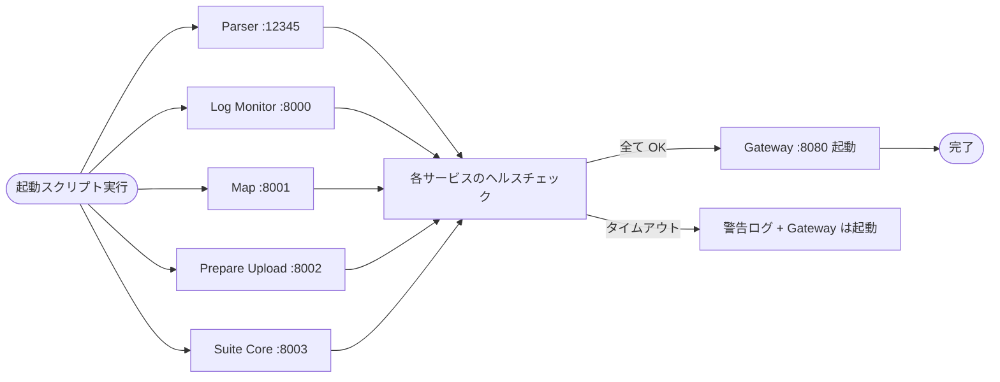

# 04. API Gateway 設計

## 1. 概要・選定基準

統合フロントから 5 つのバックエンドサービス（`03_api_specification.md` §2.1）を一枚のオリジン（`http://localhost:8080`）越しに利用するために、API Gateway を 1 つ用意する。

### 選定基準

| 基準 | 重要度 | 理由 |
|---|---|---|
| Windows ローカルでの起動の容易さ | ★★★ | 個人ツール、ワンクリック起動が前提 |
| **SSE のプロキシ対応** | ★★★ | `Log Monitor /api/stream` が SSE で push する |
| 静的ファイル配信 | ★★ | フロントの `dist/` をそのまま配信したい |
| 設定の簡潔さ | ★★ | 設定 1 ファイルで全ルートを把握できる程度 |
| 将来の拡張余地 | ★★ | 集約 API・認証・ログ等を足せる |
| 実装言語の統一 | ★ | 既存 Python サービスと揃えると保守が楽 |

---

## 2. 候補比較

### 2.1 Nginx

| 項目 | 評価 |
|---|---|
| 起動 | Windows 版は ZIP 配布あるが、サービス化や SIGTERM 周りに癖。`nginx -s stop` 等のコマンドがやや煩雑 |
| 設定 | `nginx.conf` の構造は強力だが冗長。`location` ブロックを増やすと長くなる |
| SSE | `proxy_buffering off; proxy_cache off; proxy_read_timeout` 等の追加設定が必須 |
| 静的配信 | 得意。`root` と `try_files` で SPA fallback も書ける |
| 拡張性 | 集約 API は不可。Lua/njs を使えば一部可能だが個人ツールには重い |
| 言語統一 | Python と無関係 |

### 2.2 Caddy

| 項目 | 評価 |
|---|---|
| 起動 | Windows 単一バイナリ、`caddy run` で即起動 |
| 設定 | Caddyfile が極めて簡潔（Nginx の 1/3〜1/5 行数） |
| SSE | デフォルトでバッファリングなし、追加設定不要 |
| 静的配信 | `file_server` + `try_files` で SPA fallback |
| 拡張性 | 集約 API は不可。プラグイン機構あるが Go 開発が必要 |
| 言語統一 | Python と無関係 |

### 2.3 FastAPI 自作 gateway（採用）

| 項目 | 評価 |
|---|---|
| 起動 | `uvicorn gateway.main:app --port 8080`、他の Python サービスと同じ起動方式 |
| 設定 | Python コード上で記述。ルートテーブルを Python の dict で持てば一覧性も担保可 |
| SSE | `httpx.AsyncClient.stream()` + `StreamingResponse` で素直に実装可。バッファリング無効化も自然 |
| 静的配信 | `StaticFiles` + 404 → `index.html` フォールバック、SPA 対応容易 |
| 拡張性 | 集約 API、認証ミドルウェア、共通ロギング、レート制限、すべて Python で追加可能 |
| 言語統一 | Suite Core / Log Monitor / Map / Prepare Upload と同じスタック。Python 一本化 |

### 2.4 Traefik / HAProxy（参考）

- Traefik: 動的 service discovery やコンテナ前提の機能が中心、個人ローカル静的構成では過剰
- HAProxy: L4/L7 双方の高機能ロードバランサだが、Windows サポートが弱く設定も冗長
- いずれも今回の用途では選定しない

---

## 3. 推奨案: FastAPI 自作 gateway

### 評価マトリクス

| 候補 | Win 起動 | 設定簡潔 | SSE | 静的配信 | 拡張性 | 言語統一 | 合計 |
|---|---|---|---|---|---|---|---|
| Nginx | △ | △ | △（要設定） | ○ | × | × | △ |
| Caddy | ○ | ◎ | ◎ | ○ | △ | × | ○ |
| **FastAPI gateway** | ○ | ○ | ○ | ○ | ◎ | ◎ | **◎** |

### 選定根拠

1. **Python 一本化のメリットが大きい**: 5 サービス中 4 つが Python 製。起動スクリプトも Python の `concurrent.futures` や同一の `uvicorn` 起動方式で統一できる
2. **SSE プロキシが素直に書ける**: `httpx.stream()` + `StreamingResponse` のパターンが定石化している（数十行）
3. **将来必須になる集約 API がある**: ダッシュボードの「直近の試合一覧 + 現在 phase + 集計」を 1 リクエストで取得したくなる場面が想定される。これは FastAPI gateway 内で複数 upstream を並行呼び出しできれば最も自然
4. **個人ツール規模なら設定量の不利は無視できる**: ルート定義の差分は 30 行程度

### 採用しない判断のリスクと対応

- **「ただのプロキシ」より処理量が増えるのでは?**
  - 対応: gateway は I/O バウンド処理のみ。`asyncio` ベースなので CPU 負荷は無視できる
- **gateway 自体のバグでフロント全停止リスク**
  - 対応: 上流サービスは個別ポートで直接アクセス可能。デバッグ時は gateway をバイパスしてフロントを `:5173` で起動できる

---

## 4. ルーティング設計

### 4.1 パス前置詞 → 上流対応表

`03_api_specification.md` §9.1 で定義済みのものを確定版として再掲。

| Path Prefix | Upstream | 上流での書き換え | SSE? |
|---|---|---|---|
| `/api/replay-parser/*` | `http://127.0.0.1:12345` | `/api/replay-parser/X` → `/api/X`（`/health` はそのまま） | — |
| `/api/log-monitor/*` | `http://127.0.0.1:8000` | `/api/log-monitor/X` → `/X`（上流が `/events` 等をトップレベルに持つ） | `events` のみ |
| `/api/map/*` | `http://127.0.0.1:8001` | `/api/map/X` → `/api/X` | — |
| `/api/prepare-upload/*` | `http://127.0.0.1:8002` | `/api/prepare-upload/X` → `/api/X` | — |
| `/api/suite/*` | `http://127.0.0.1:8003` | `/api/suite/X` → `/api/X` | — |
| `/` | （静的・Phase 6 未実装） | `frontend/dist/` を将来的に配信 | — |
| 上記以外（SPA fallback） | （静的・Phase 6 未実装） | `dist/index.html` | — |

### 4.2 パス書き換えルール

ルートテーブルは Python の dict で 1 箇所に集約する想定。

```python
# 実装: gateway/app/main.py + services/_common/ports.py
ROUTES = {
    "/api/replay-parser":  "http://127.0.0.1:12345",
    "/api/log-monitor":    "http://127.0.0.1:8000",
    "/api/map":            "http://127.0.0.1:8001",
    "/api/prepare-upload": "http://127.0.0.1:8002",
    "/api/suite":          "http://127.0.0.1:8003",
}

# /api/replay-parser/upload → http://127.0.0.1:12345/api/upload
# /api/log-monitor/events   → http://127.0.0.1:8000/events
# /api/map/render           → http://127.0.0.1:8001/api/render
```

書き換えは **「prefix を消して `/api` を付け直す」** が基本。ただし `/api/log-monitor/*` だけは上流（`log_monitor_api`）が `/events` 等をトップレベルに持つため **prefix を剥がすだけ** でよい。また `/health` は全サービスでそのまま透過する。

### 4.3 同一オリジンによる CORS 不要化

- フロントから見える URL はすべて `http://localhost:8080` 配下
- 各上流サービスは `127.0.0.1` バインド + CORS 無効
- ブラウザは preflight も発行しない（同一オリジン）
- 開発時の Vite dev (`:5173`) は Vite の `server.proxy` で `:8080` に転送し、本番と挙動を揃える（詳細は `05_frontend_design.md` で）

---

## 5. SSE プロキシ設定要件

### 5.1 バッファリング無効化

- HTTP レスポンスを **そのまま透過する** こと
- httpx の `client.stream("GET", url)` でレスポンスを開き、`response.aiter_raw()` を `StreamingResponse` でフロントに流す
- gzip/Brotli 圧縮ミドルウェアは SSE エンドポイントには適用しない

### 5.2 タイムアウト・keepalive

| 項目 | 設定値 |
|---|---|
| httpx クライアントのタイムアウト | `Timeout(connect=5, read=None, write=5, pool=None)`（read 無制限） |
| FastAPI / uvicorn のタイムアウト | `--timeout-keep-alive 75`（既定 5 → 75 秒に拡張） |
| keepalive コメント送信 | 上流（Log Monitor）が 30 秒ごとに `: keepalive\n\n` 送出（`03` §3.6 に既出） |

### 5.3 自動再接続との相性

- ブラウザの `EventSource` はデフォルトで再接続するが、再接続のたびに gateway は新しい上流接続を張る
- 上流（Log Monitor）はリングバッファを持ち、新規接続時に `event: backlog` で直近を再送する設計（`03` §5.4）
- gateway 自体は接続ごとに独立。状態を持たない

### 5.4 SSE エンドポイントの実装イメージ

```python
# 擬似コード — 実装では proxy_log_monitor 内で timeout=_SSE_TIMEOUT で統一
@app.get("/api/log-monitor/events")
async def proxy_sse():
    async def generator():
        async with httpx.AsyncClient(timeout=Timeout(connect=5, read=None)) as client:
            async with client.stream("GET", "http://127.0.0.1:8000/events") as upstream:
                async for chunk in upstream.aiter_raw():
                    yield chunk
    return StreamingResponse(
        generator(),
        media_type="text/event-stream",
        headers={"Cache-Control": "no-cache", "X-Accel-Buffering": "no"},
    )
```

---

## 6. 静的ファイル配信

### 6.1 dist/ の配置

- ビルド成果物の配置先: `Integrated_App/frontend/dist/`
- gateway は起動時にこのディレクトリのフルパスを解決
- 開発時はフロントを Vite dev (`:5173`) で起動し、gateway は静的配信を「ディレクトリなし」フォールバックでスキップ（`/` は Vite 側に委譲、または gateway 起動なしで運用）

### 6.2 SPA fallback (index.html)

React Router を BrowserRouter で使う前提。未マッチパスは `index.html` を返す。

```python
# 擬似コード
app.mount("/assets", StaticFiles(directory="frontend/dist/assets"), name="assets")

@app.get("/{full_path:path}")
async def spa_fallback(full_path: str):
    # /api/* は他のルートで処理されるため、ここに来るのは未マッチパスのみ
    return FileResponse("frontend/dist/index.html")
```

ルート登録順序: API ルート → アセット → fallback の順。

### 6.3 キャッシュ制御

| パス | Cache-Control |
|---|---|
| `/assets/*`（Vite が hash 付きファイル名で出力） | `public, max-age=31536000, immutable` |
| `/index.html` | `no-cache` |
| `/api/*` | 各上流サービスのレスポンスを透過 |

---

## 7. 起動方法

### 7.1 単体起動コマンド

```
uvicorn gateway.main:app --host 127.0.0.1 --port 8080
```

`--reload` は開発時のみ。Windows で `Ctrl+C` 終了が利く。

### 7.2 全サービス起動スクリプトとの統合

- `06_deployment.md` で扱う PowerShell / bat ワンクリック起動の中で、gateway は **最後に起動**する
- 起動順: 上流 5 サービス → 各サービスのヘルスチェックが通ってから → gateway
- 詳細スクリプトは `06_deployment.md`

### 7.3 Windows サービス化は採用しない

- 個人ツール、起動・停止を明示的に行う運用
- ログ確認やデバッグの容易さを優先
- `nssm` 等での Windows サービス化は将来オプションとして残すのみ

---

## 8. 設定ファイル雛形（擬似コード）

### 8.1 推奨案: FastAPI gateway の構造

```
Integrated_App/gateway/
├── main.py            # FastAPI app + ルート定義
├── routes.py          # ROUTES dict と prefix→upstream 対応表
├── proxy.py           # 汎用プロキシ関数（GET/POST/PUT/DELETE）
├── sse.py             # SSE 専用プロキシ
├── static.py          # StaticFiles マウント + SPA fallback
└── config.py          # ポート、ヘルスチェック先、タイムアウト等
```

### 8.2 main.py の構造（擬似コード）

```python
# 擬似コード — 実装は Phase 別に行う
from fastapi import FastAPI
from gateway.routes import ROUTES
from gateway.proxy import register_proxy_routes
from gateway.sse import register_sse_routes
from gateway.static import register_static_routes

app = FastAPI(title="Fortnite Suite Gateway")

# 1. SSE ルート（特殊扱い、最優先）
register_sse_routes(app, sse_endpoints=[
    ("/api/log/stream", "http://127.0.0.1:8001/api/stream"),
])

# 2. 通常 API ルート（汎用プロキシ）
register_proxy_routes(app, routes=ROUTES)

# 3. 静的 + SPA fallback
register_static_routes(app, dist_dir="frontend/dist")
```

### 8.3 開発時 (Vite dev) のプロキシ設定

`vite.config.ts` 側で `/api` を gateway (`:8080`) に転送し、フロント側のコードは本番と同じ URL でアクセスできるようにする。

```ts
// 擬似コード（05 で詳細化）
export default defineConfig({
  server: {
    proxy: {
      "/api": { target: "http://127.0.0.1:8080", changeOrigin: false },
    },
  },
});
```

---

## 9. ヘルスチェック・障害時挙動

### 9.1 上流サービスダウン時のレスポンス

汎用プロキシは httpx の例外を以下にマップする:

| 例外 | HTTP Status | code |
|---|---|---|
| `httpx.ConnectError` | 503 | `UPSTREAM_UNAVAILABLE` |
| `httpx.ReadTimeout` | 504 | `UPSTREAM_TIMEOUT` |
| `httpx.HTTPStatusError`（5xx） | 502 | `UPSTREAM_BAD_GATEWAY` |
| `httpx.HTTPStatusError`（4xx） | そのまま透過 | （上流レスポンスをそのまま返却） |

レスポンスボディは `03` §3.1 のエラー形式に揃える:

```json
{
  "error": "Log Monitor サービスに接続できません",
  "code": "UPSTREAM_UNAVAILABLE",
  "detail": { "upstream": "http://127.0.0.1:8001", "path": "/api/status" }
}
```

### 9.2 起動順序



ヘルスチェック先（各サービスに `GET /api/health` を追加する想定）:
- Parser: 軽量レスポンスを返す `/health` 追加が望ましい（既存にはない、追加スコープ）
- Log Monitor / Map / Suite Core: FastAPI 標準で `/api/health` 実装可
- Prepare Upload: 既に `/api/health`（ffmpeg 検出）を仕様化済み

ヘルスチェックタイムアウトは 10 秒、失敗してもgateway は起動する（フロントから個別にエラー表示）。

### 9.3 Gateway 自身のヘルス

- `GET /health` を gateway 自身に追加
- 各 upstream への接続可否を返す:
  ```json
  {
    "status": "ok",
    "upstreams": {
      "replay_parser":       { "status": "ok",   "port": 12345 },
      "log_monitor_api":     { "status": "ok",   "port": 8000 },
      "map_api":             { "status": "down", "port": 8001, "error": "ConnectError" },
      "prepare_upload_api":  { "status": "ok",   "port": 8002 },
      "suite_core":          { "status": "ok",   "port": 8003 }
    }
  }
  ```
- フロントの「サービス状態」UI でこれを利用

---

## 10. 将来拡張ポイント

統合スコープ外だが、FastAPI gateway を選んだことで容易に追加可能な拡張:

| 拡張 | 実装イメージ |
|---|---|
| 集約 API | `/api/dashboard/summary` 等を gateway 内で複数 upstream を並行呼び出し合成 |
| 共通ロギング | FastAPI middleware で全リクエスト/レスポンスを構造化ログ出力 |
| 認証（将来 LAN 利用時） | API キーミドルウェア追加、`X-API-Key` ヘッダ検証 |
| HTTPS 化 | `uvicorn --ssl-keyfile --ssl-certfile`、または前段に Caddy を置く2段構成 |
| レート制限 | `slowapi` パッケージで簡易実装 |
| WebSocket 追加 | FastAPI 標準、ルート追加のみ |

---

（本ドキュメントここまで）
