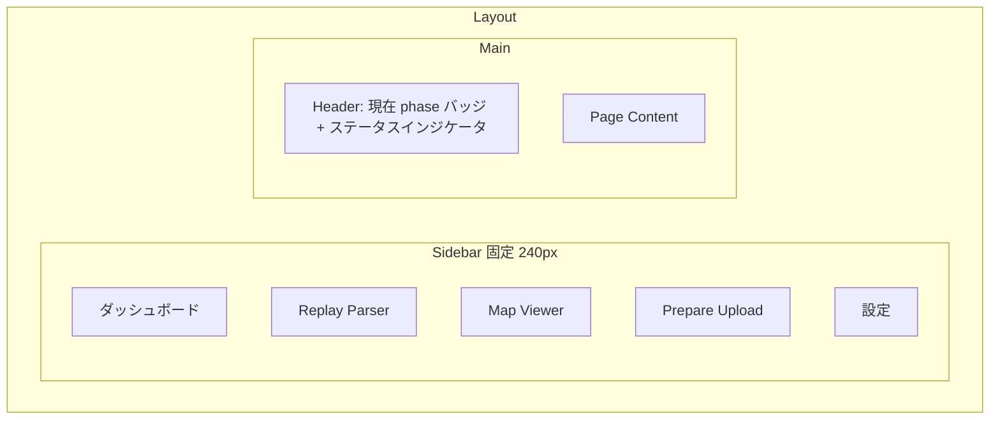
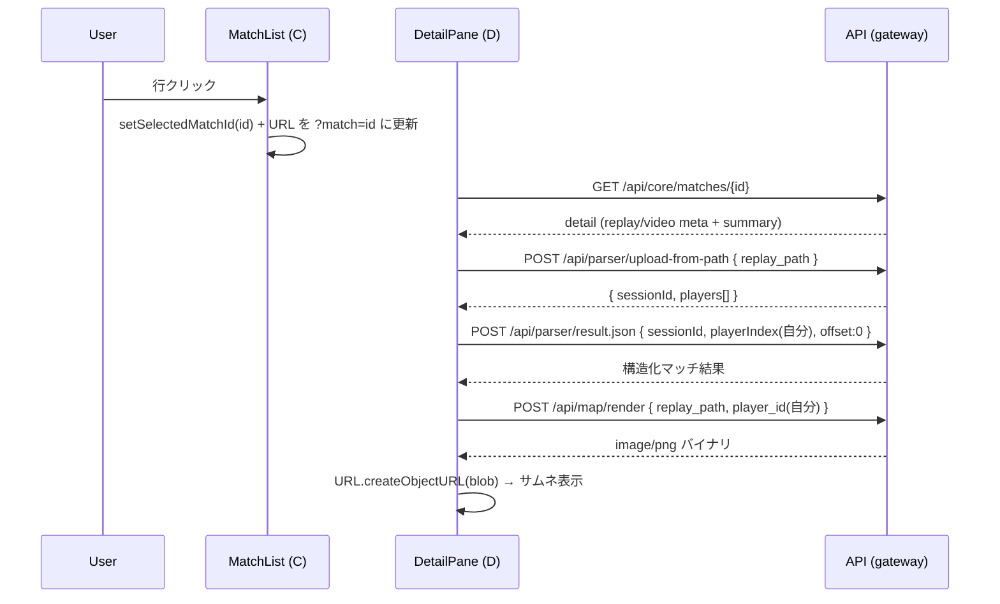

# 05. フロントエンド設計

## 1. 概要・スコープ

統合フロントエンドの画面構成、ルーティング、API 呼び出し、状態管理、デザイン方針を定義する。

### 採用技術スタック（確定）

| 領域 | 採用技術 |
|---|---|
| UI フレームワーク | React 19 + TypeScript |
| ビルド | Vite |
| スタイリング | Tailwind CSS v4 |
| UI コンポーネント | shadcn/ui（Radix UI ベース） |
| サーバ状態管理 | TanStack Query v5 |
| ルーティング | React Router v6 (BrowserRouter) |
| アイコン | lucide-react（shadcn 標準） |
| 型定義 | TypeScript strict mode |

### 設計方針

- **コンポーネント配置は開発時に固定**（実行時のドラッグ&ドロップ等の配置変更 UI なし）
- **左サイドバー型ダッシュボード**を基本レイアウトとする
- デザインカスタマイズ性を重視するため、shadcn は CLI で本リポジトリに**生成物として持つ**（外部依存にしない）
- 個人ローカル運用、認証なし、i18n なし（日本語 UI）

---

## 2. 画面構成

### 2.1 全体レイアウト



- **Sidebar**: 固定幅 240px、shadcn の `Sidebar` コンポーネント or `NavigationMenu`+カスタム CSS
  - 5 ナビ項目: ダッシュボード / Replay Parser / Map Viewer / Prepare Upload / 設定
  - ロゴ + アプリ名（"Fortnite Suite"）を最上部
  - サービス接続状態の小さなインジケータ（gateway `/health` ベース）を最下部
- **Header**: 高さ 56px
  - 左: 現在の Fortnite ステータス（phase バッジ、`ロビー / マッチメイキング / 試合中 / ...`）
  - 右: テーマ切替トグル（システム / ライト / ダーク）、再接続ボタン（SSE 切断時のみ表示）
- **Content**: 残り領域、各ページのレイアウトに従う

### 2.2 各ページの概観

| ページ | 主役要素 | 主要 UI |
|---|---|---|
| Dashboard | Master-Detail（試合一覧 + 詳細展開） | Card, Tabs, Table, Skeleton |
| Replay Parser | リプレイ選択 → 構造化結果表示 | FileInput, Select, Card, Table |
| Map Viewer | リプレイ + プレイヤー選択 → PNG | Select, Skeleton, Image, Button |
| Prepare Upload | Stepper による段階的操作 | Stepper(自作), Select, Slider, Button |
| 設定 | 設定値の表示と編集 | Form, Input, Switch, Button |

各ページのワイヤフレーム詳細は §5〜§9。

---

## 3. ルーティング設計

### 3.1 パス一覧

| Path | コンポーネント | 用途 |
|---|---|---|
| `/` | `<Dashboard />` | 試合一覧 + 現在ステータス + 集計 + Master-Detail 詳細 |
| `/parser` | `<ParserPage />` | Replay Parser 単体 |
| `/parser/sessions/:sessionId` | `<ParserPage />` | 既存セッションを開いた状態で表示（ディープリンク） |
| `/map` | `<MapPage />` | Map Viewer 単体 |
| `/upload` | `<UploadPage />` | Prepare Upload Stepper |
| `/settings` | `<SettingsPage />` | グローバル設定 |
| `/setup` | `<SetupPage />` | 初回起動時のセットアップ（user_player_id 未設定時に強制リダイレクト） |
| `*` | `<NotFound />` | 404 |

### 3.2 ネスト構造（レイアウトルート）

```tsx
// 擬似コード
<BrowserRouter>
  <Routes>
    <Route element={<RootLayout />}>
      <Route element={<RequireSetup />}>
        <Route index element={<Dashboard />} />
        <Route path="parser" element={<ParserPage />} />
        <Route path="parser/sessions/:sessionId" element={<ParserPage />} />
        <Route path="map" element={<MapPage />} />
        <Route path="upload" element={<UploadPage />} />
        <Route path="settings" element={<SettingsPage />} />
      </Route>
      <Route path="setup" element={<SetupPage />} />
      <Route path="*" element={<NotFound />} />
    </Route>
  </Routes>
</BrowserRouter>
```

- `<RootLayout />`: サイドバー + ヘッダー + `<Outlet />`
- `<RequireSetup />`: `useConfig()` で `userPlayerId` が空なら `/setup` にリダイレクト
- `<SetupPage />` は `<RootLayout />` 配下だが `<RequireSetup />` を通さない

### 3.3 ディープリンク

| ディープリンク | 状態復元内容 |
|---|---|
| `/parser/sessions/:sessionId` | 既存セッション ID で結果を再取得 |
| `/?match=2026-03-21T19-35-42` | クエリ文字列で対象マッチを選択状態にする |
| `/upload?video=...&replay=...` | クエリ文字列で初期入力を埋める |

---

## 4. shadcn/ui コンポーネント採用一覧

導入予定のコンポーネント（CLI で `npx shadcn@latest add <name>` を想定）:

| コンポーネント | 利用ページ |
|---|---|
| `button` | 全ページ |
| `card` | Dashboard, Parser, Map |
| `tabs` | Dashboard 詳細ペイン, Parser 結果 |
| `table` | Dashboard 試合一覧, Parser eliminations, Upload candidates |
| `input` | Settings, Upload（手動時刻入力）, Parser（offset） |
| `select` | プレイヤー選択, リプレイ選択 |
| `dialog` | Map 画像の拡大表示, 設定の確認 |
| `sheet` | （将来用、サイドドロワー） |
| `skeleton` | ローディング |
| `badge` | phase 表示, has_video / has_replay 等のフラグ |
| `tooltip` | 各種補足 |
| `separator` | カード内の区切り |
| `slider` | Upload の秒数微調整 |
| `switch` | Settings のトグル, テーマ |
| `dropdown-menu` | テーマ切替, ヘッダーメニュー |
| `toast`（sonner） | 操作結果の通知（PUT 成功、エラー等） |
| `form` | Settings の編集フォーム |
| `progress` | Upload の処理進行表示 |
| `scroll-area` | 試合一覧、イベントログ |
| `alert` | エラー表示 |

### カスタムコンポーネント（自作）

| 名称 | 用途 |
|---|---|
| `<PhaseBadge />` | phase 名 + 色 + アイコン（log_monitor の 14 種に対応） |
| `<MatchListItem />` | 試合一覧 1 件分（サムネ + メタ情報） |
| `<MapThumbnail />` | Map 画像のサムネイル + クリックで拡大 |
| `<MapImageDialog />` | 原寸大 Map をモーダルで表示 + ダウンロードボタン |
| `<Stepper />` | Upload の 4 ステップ進行 UI |
| `<KeyframePicker />` | キーフレーム一覧 + ラジオ選択 |
| `<ServiceStatusIndicator />` | gateway `/health` の結果を点 5 個で可視化 |
| `<EventLogList />` | log_monitor のイベント履歴をスクロール表示 |
| `<ThemeToggle />` | システム/ライト/ダーク切替（dropdown-menu ベース） |

---

## 5. ダッシュボード詳細設計

### 5.1 レイアウト（Master-Detail 同一画面）

```
┌──────────────────────────────────────────────────────────────────┐
│ [Header: 現在 phase バッジ "🎯 試合中"]                          │
├──────────────────────────────────────────────────────────────────┤
│ ┌─────────────── A ───────────────┐ ┌────────── B ──────────┐   │
│ │ 📊 セッション集計                │ │ 🎮 現在のステータス   │   │
│ │  試合数: 7  /  平均所要: 17:23   │ │  Phase: 試合中        │   │
│ │  検出イベント: 142件             │ │  最新: ストーム収縮中 │   │
│ │                                  │ │  OBS: 接続中          │   │
│ └──────────────────────────────────┘ └───────────────────────┘   │
│                                                                  │
│ ┌─────────── C: 直近の試合一覧 (Master) ─────────────┐ ┌─ D ─┐  │
│ │ ▸ 2026-03-21 19:54  [video✓ replay✓]              │ │ 詳細│  │
│ │   2026-03-21 19:35  [video✓ replay✓]  ← 選択中    │ │ ペイ│  │
│ │   2026-03-21 18:50  [video✗ replay✓]              │ │ ン   │  │
│ │   2026-03-21 18:20  [video✓ replay✗]              │ │     │  │
│ │   ...                                              │ │     │  │
│ └────────────────────────────────────────────────────┘ └─────┘  │
└──────────────────────────────────────────────────────────────────┘
```

| 領域 | 内容 | データソース |
|---|---|---|
| A: セッション集計 | 試合数、平均所要時間、イベント数 | `GET /api/log/aggregate` |
| B: 現在のステータス | phase / 最新イベント / OBS / fortnite起動 | `GET /api/log/status` + SSE で更新 |
| C: 試合一覧 (Master) | OBS動画 + Replay のペア一覧 | `GET /api/core/matches` |
| D: 詳細ペイン (Detail) | 選択された試合のパース結果 + Map サムネ | `GET /api/core/matches/{id}` + `POST /api/parser/result.json` + `POST /api/map/render` |

### 5.2 詳細ペイン (D) の構成

選択された試合の詳細を以下の Tabs で表示:

```
┌─────────── D: 詳細ペイン ────────────┐
│ [概要 | キル/順位 | Map | システム ]  │
├─────────────────────────────────────┤
│ (選択タブの内容)                     │
│                                      │
│ Map タブ:                            │
│  ┌──────────┐                        │
│  │  thumb   │ ← クリックで拡大       │
│  │ 256x256  │   モーダル + DLボタン  │
│  └──────────┘                        │
└──────────────────────────────────────┘
```

| Tab | 内容 |
|---|---|
| 概要 | 開始/終了時刻、参加者数、自分の順位、コスメ名 |
| キル/順位 | キル相手リスト、自分が倒された相手、順位 |
| Map | サムネイル → クリックで `<MapImageDialog />`（原寸モーダル + ダウンロード） |
| システム | system_info (OS/CPU/GPU/RAM/解像度) |

### 5.3 マッチ選択時のインタラクション



- `playerIndex(自分)` は **`config.userPlayerId` から `players[]` を引いて算出**
- マッチ選択を切り替える際、前のセッションは `DELETE /api/parser/session/{sessionId}` で破棄
- Map 画像の URL（blob URL）は `useEffect` のクリーンアップで `URL.revokeObjectURL`

### 5.4 「画像をクリックしたら原寸大」フロー（Q5 確定）

- サムネイルは Map レスポンスの blob を `` で縮小表示
- クリック → `<MapImageDialog />`（shadcn `dialog`）が開き、原寸 PNG（同じ blob URL を再利用）を表示
- モーダル右上に **「ダウンロード」ボタン**: `<a href={blobUrl} download={`${matchId}_map.png`}>` で保存
- モーダル右上に **「新しいタブで開く」ボタン**: `window.open(blobUrl, "_blank")`
- モーダル閉じても blob URL は試合選択が変わるまで保持（再クリック時に瞬時表示）

---

## 6. Replay Parser 単体ページ設計

ダッシュボードの簡易版を独立して使えるページ。Match Library 経由ではなく、任意の `.replay` を直接アップロードして試したい場合用。

```
┌──────── Step 1: ファイル選択 ────────┐
│ [.replay を選択]  [Demos から選択 ▼] │
└──────────────────────────────────────┘
┌──────── Step 2: プレイヤー選択 ──────┐
│ [プレイヤー: 自分（既定）        ▼] │
│ [Time Offset: -5 ▼]                 │
└──────────────────────────────────────┘
┌──────── 結果（構造化）──────────────┐
│ Card: 試合情報                       │
│ Card: 自分                           │
│ Table: キル一覧                      │
│ Card: 倒された相手（あれば）         │
│ Card: システム情報                   │
└──────────────────────────────────────┘
```

- 「Demos から選択」は Suite Core が起動済みなら使え、`config.demosDir` 配下を一覧表示
- プレイヤー選択ドロップダウンは `players[]` から、デフォルトは `userPlayerId` に一致するもの
- 結果は `POST /api/parser/result.json` で取得し、shadcn の Card / Table で表示
- 既存 Parser のフロント（`wwwroot/index.html`）の機能はすべてカバーする

---

## 7. Map Viewer 単体ページ設計

```
┌──────────────────────────────────────────┐
│ [リプレイ: ... ▼]  [プレイヤー: ... ▼] │
│ [描画]  [ダウンロード]                   │
├──────────────────────────────────────────┤
│                                          │
│      ┌──────────────────────────┐       │
│      │                          │       │
│      │   Map 画像（最大幅）     │       │
│      │   ローディング: Skeleton │       │
│      │                          │       │
│      └──────────────────────────┘       │
│                                          │
│  Z stats: min=...  mean=...  max=...    │
│  Point count: 1834                       │
└──────────────────────────────────────────┘
```

- リプレイ選択は Match Library の試合 + 「ファイルを直接選択」の両対応
- プレイヤー選択は `GET /api/map/players?replay_path=...` で取得（自分が初期選択）
- 描画ボタンで `POST /api/map/render`、レスポンスヘッダの `X-Map-*` を表示
- ダウンロードボタンは Dashboard と同様 `<a download>`

---

## 8. Prepare Upload ページ詳細設計

### 8.1 Stepper

```
┌─ Stepper ─────────────────────────────────────────┐
│ ① ファイル選択 ─ ② 候補時刻 ─ ③ キーフレーム ─ ④ 実行 │
└────────────────────────────────────────────────────┘
```

shadcn には Stepper がないため自作。各ステップで `Card` + `Button` で構成し、現在ステップ以外は無効化表示。

### 8.2 Step 1: ファイル選択

- **動画ファイル**: 「動画を選択」ボタン → `config.obsRecordingDir` 配下の MP4 一覧から選択
- **リプレイファイル**: Match Library から推測（動画選択時に対応するリプレイを自動候補表示） + 「直接選択」も可
- 「次へ」ボタンで Step 2 へ

### 8.3 Step 2: 候補時刻リスト

```
[POST /api/upload/candidates] の結果を表示

┌─ 候補リスト ──────────────────────────────────────┐
│ ○ 試合開始        00:11:55  [選択]                │
│ ● Kill #1 ばーくん 00:15:37  [選択]  ← 選択中     │
│ ○ Kill #2 ばずくん 00:17:23  [選択]                │
│ ○ Kill #3 ぽぽくん 00:19:01  [選択]                │
│ ○ 試合終了        00:30:31  [選択]                │
└────────────────────────────────────────────────────┘

選択中の時刻: 00:15:37
[─── ─ ──●───── +] -10s ─── 0 ─── +10s   ← Slider
微調整: [+5 秒] [+1 秒] [-1 秒] [-5 秒]   ← ボタン

最終的なオフセット: 00:15:42 (937.0 + 5.0 = 942.0s)

[次へ: キーフレーム検索]
```

- 候補は表 (Table) または Radio リスト
- 選択後に **Slider + ボタン**で秒単位調整（Q.C 確定）
- 「次へ」で `POST /api/upload/keyframes` を発火

### 8.4 Step 3: キーフレーム選択

```
[POST /api/upload/keyframes] の結果

┌─ キーフレーム ────────────────────┐
│ ○ [1] 00:15:37.234  (937.234s)    │
│ ● [2] 00:15:40.012  (940.012s) ← │
│ ○ [3] 00:15:43.567  (943.567s)    │
└────────────────────────────────────┘

[戻る]  [次へ: トリミング実行]
```

### 8.5 Step 4: 実行 + 結果

```
┌─ 実行 ────────────────────────────────────────┐
│ 入力動画: replay 2026-03-21 19-54-30.mp4      │
│ 開始位置: 00:15:40.012                         │
│ 出力先: 同フォルダの upload.mp4                │
│                                                │
│ [トリミング実行]                                │
└────────────────────────────────────────────────┘

実行中: Progress + 「処理中…」(タイムアウト 60 秒)

完了:
┌─ 結果 ───────────────────────────────────────┐
│ ✅ upload.mp4 を作成しました (234 MB, 15:06)  │
│ [エクスプローラで開く]  [もう一本作る]        │
└──────────────────────────────────────────────┘
```

- 「エクスプローラで開く」: `window.open()` できないので、`POST /api/upload/reveal { path }` 等のサポート API を将来追加（初版は出力パス文字列のコピー UI で代替）
- 「もう一本作る」: Stepper を Step 1 に戻すが、動画 + リプレイは保持

---

## 9. 設定ページ

```
┌─ 設定 ───────────────────────────────────┐
│ 自分のプレイヤー ID                       │
│   [ABC123XYZ...]            [変更]        │
│                                           │
│ Demos フォルダ                            │
│   C:\Users\xxx\AppData\Local\...\Demos    │
│   [パス変更]                              │
│                                           │
│ OBS 録画フォルダ (取得元: OBS WebSocket)  │
│   C:\Users\xxx\Videos                     │
│   [パス変更]  [OBS から再取得]            │
│                                           │
│ Fortnite ログパス                         │
│   C:\Users\xxx\...\FortniteGame.log       │
│   [パス変更]                              │
│                                           │
│ ──────────────────────────────────        │
│ テーマ: ( ○ システム  ○ ライト  ● ダーク )│
│                                           │
│ ──────────────────────────────────        │
│ サービス状態                              │
│   Parser     ✅                            │
│   Log Monitor ✅                           │
│   Map        ✅                            │
│   Upload     ✅                            │
│   Suite Core ✅                            │
└───────────────────────────────────────────┘
```

- 編集は `<Form />` + `Input` + 「変更」ボタンで個別 PUT
- `POST /api/parser/upload-from-path` でリプレイから player_id 候補を取り直し、選択 UI で `userPlayerId` を更新する補助 UI を別途用意（最初は手入力で OK）
- サービス状態は `GET /health`（gateway）の結果を 30 秒間隔でポーリング

---

## 10. API 呼び出し構造（TanStack Query）

### 10.1 クエリキー命名規則

`[<domain>, <action>, ...args]` の配列形式:

```ts
// 例
["matches", "list"]                           // GET /api/core/matches
["matches", "detail", matchId]                // GET /api/core/matches/{id}
["config"]                                    // GET /api/core/config
["log", "status"]                             // GET /api/log/status
["log", "events", { since, limit }]           // GET /api/log/events
["log", "aggregate", { lastN }]               // GET /api/log/aggregate
["map", "players", replayPath]                // GET /api/map/players
["map", "render", { replayPath, playerId }]   // POST /api/map/render
["parser", "result", { sessionId, playerIndex, offset }]
```

### 10.2 カスタムフック分割

| フック | クエリキー | 戻り値 |
|---|---|---|
| `useMatches()` | `["matches", "list"]` | `Match[]` |
| `useMatchDetail(id)` | `["matches", "detail", id]` | `MatchDetail` |
| `useConfig()` | `["config"]` | `Config` |
| `useUpdateConfig()` | mutation | `(partial) => void` |
| `useLogStatus()` | `["log", "status"]` | `LogStatus` |
| `useLogAggregate(lastN)` | `["log", "aggregate", { lastN }]` | `LogAggregate` |
| `useMapPlayers(replayPath)` | `["map", "players", replayPath]` | `Player[]` |
| `useMapRender({ replayPath, playerId })` | `["map", "render", ...]` | `Blob URL` |
| `useParserResult({ sessionId, playerIndex, offset })` | `["parser", "result", ...]` | `MatchResult` |
| `useUploadCandidates({ videoPath, replayPath })` | mutation | `Candidate[]` |
| `useUploadKeyframes({ videoPath, aroundOffset })` | mutation | `Keyframe[]` |
| `useUploadTrim({ videoPath, startOffset })` | mutation | `TrimResult` |
| `useGatewayHealth()` | `["gateway", "health"]` | `HealthStatus` |

ファイル構成:
```
src/api/
├── client.ts            # axios/fetch ラッパー、camelCase 変換
├── matches.ts           # useMatches, useMatchDetail
├── config.ts            # useConfig, useUpdateConfig
├── log.ts               # useLogStatus, useLogAggregate
├── map.ts               # useMapPlayers, useMapRender
├── parser.ts            # useParserUploadFromPath, useParserResult
├── upload.ts            # useUploadCandidates, useUploadKeyframes, useUploadTrim
└── gateway.ts           # useGatewayHealth
src/hooks/
└── useLogStream.ts      # SSE フック（TanStack Query 外）
```

### 10.3 ミューテーション

PUT/POST 系（`useUpdateConfig`、`useUploadTrim` 等）は `useMutation` を使用。成功時の invalidate ターゲット:

| ミューテーション | invalidate するキー |
|---|---|
| `useUpdateConfig` | `["config"]`、必要に応じて `["matches", "list"]`（demosDir / obsRecordingDir 変更時） |
| `useUploadTrim` | （特になし） |
| `useRefreshMatches` | `["matches", "list"]` |

### 10.4 invalidate / refetch のタイミング

| イベント | 動作 |
|---|---|
| 設定 PUT 成功 | `["config"]`, `["gateway", "health"]` invalidate |
| Match Library 手動リフレッシュ | `["matches", "list"]` invalidate |
| SSE で `event_detected` 受信 | `["log", "status"]` invalidate（軽量取得） |
| SSE で `phase_change` 受信 | ヘッダーの phase バッジを SSE 経由で直接更新（`useLogStream` 内） |
| マッチ選択変更 | 前のセッションを DELETE、新しい sessionId を取得 |

### 10.5 SSE の組み込み

TanStack Query は HTTP 1 リクエスト=1 レスポンスを前提としているため、SSE は別フック `useLogStream()` で扱う。

```ts
// 擬似コード
function useLogStream() {
  const queryClient = useQueryClient();
  const [phase, setPhase] = useState<Phase | null>(null);
  const [lastEvent, setLastEvent] = useState<DetectedEvent | null>(null);
  const [connected, setConnected] = useState(false);

  useEffect(() => {
    const es = new EventSource("/api/log/stream");
    es.addEventListener("phase_change", (e) => {
      setPhase(JSON.parse(e.data));
    });
    es.addEventListener("event_detected", (e) => {
      setLastEvent(JSON.parse(e.data));
      // 集計などの軽量取得を invalidate
      queryClient.invalidateQueries({ queryKey: ["log", "status"] });
    });
    es.onopen = () => setConnected(true);
    es.onerror = () => setConnected(false);
    return () => es.close();
  }, [queryClient]);

  return { phase, lastEvent, connected };
}
```

- アプリ全体で **1 接続のみ**になるよう、`<RootLayout />` で 1 度だけ呼び、結果を Context で配る
- もしくは Zustand に格納（§11.4 参照）

---

## 11. 状態管理方針

### 11.1 TanStack Query が担う範囲（サーバ状態）

- すべての API レスポンスのキャッシュ
- ローディング / エラー / 再取得状態
- 楽観的更新（必要時）
- staleTime / gcTime のチューニング:
  - `["config"]`: `staleTime: Infinity`（PUT 後のみ invalidate）
  - `["matches", "list"]`: `staleTime: 60_000`（1 分）
  - `["log", "status"]`: `staleTime: 0`（SSE で頻繁に invalidate）
  - `["map", "render", ...]`: `staleTime: Infinity` + `gcTime: 5 * 60_000`（再選択時の即時再表示）

### 11.2 ローカル UI 状態（useState）の範囲

- フォーム入力値
- モーダルの開閉
- Stepper の現在ステップ
- ダッシュボードの選択中マッチ（URL クエリと同期）

### 11.3 Zustand 等の追加グローバルストア

**原則として導入しない**。理由:
- サーバ状態は TanStack Query
- UI 状態はコンポーネント内 or URL
- 個人ツール規模では Context + useState で十分

### 11.4 例外: SSE シングルトン

`useLogStream()` の状態は複数コンポーネントから参照される（ヘッダー + ダッシュボード）。実装方法の選択肢:

| 方式 | 採用 | 理由 |
|---|---|---|
| React Context | **採用** | 規模に対して十分、追加依存なし |
| Zustand | 不採用 | ストアが 1 つだけのために導入は過剰 |
| Jotai | 不採用 | 同上 |

→ `<LogStreamProvider />` を `<RootLayout />` 配下に置き、`useLogStreamContext()` で各所から参照する設計。

---

## 12. リアルタイム更新が必要な箇所

| 箇所 | 更新源 | 更新方法 |
|---|---|---|
| ヘッダーの現在 phase バッジ | SSE `phase_change` | `useLogStreamContext()` の `phase` を直接表示 |
| ダッシュボード B「現在のステータス」 | SSE `event_detected` + `monitor_state` | 同上 + `useLogStatus` の invalidate |
| ダッシュボード A「セッション集計」 | `event_detected` を受けて invalidate | `["log", "aggregate"]` を invalidate |
| 試合一覧 (C) | 新マッチ生成イベント（`return_lobby` 検出時） | SSE トリガーで `["matches", "list"]` invalidate + 5 分ポーリング併用 |
| サービス状態インジケータ | ポーリング | 30 秒間隔で `["gateway", "health"]` |
| Upload の進捗 | （長時間処理）| 同期 REST + クライアント側 Skeleton/Progress（SSE 化は将来オプション） |

---

## 13. 型定義（TypeScript）の管理方針

### 13.1 API レスポンス型の置き場所

```
src/types/
├── api.ts          # API レスポンスの「サーバ生形」(snake_case) -- 内部用
├── domain.ts       # フロントで扱う形 (camelCase) -- コンポーネントから参照
└── enums.ts        # phase, event_id 等の文字列リテラル union
```

### 13.2 snake_case ↔ camelCase 変換方針（Q4 確定: (b)）

- **fetcher 層 (`src/api/client.ts`) で全レスポンスを camelCase に変換**
- 変換は `camelcase-keys` ライブラリ、または自作の浅い変換関数で実装
- リクエストボディは逆方向に変換（camelCase → snake_case）
- 既存 Parser の 4 endpoints（`sessionId` 等の camelCase）は変換せず素通し
- バイナリレスポンス（PNG）は変換対象外

```ts
// 擬似コード
async function apiFetch<T>(path: string, init?: RequestInit): Promise<T> {
  const res = await fetch(path, init);
  if (!res.ok) throw await parseError(res);
  const ct = res.headers.get("Content-Type") ?? "";
  if (!ct.includes("application/json")) return res as unknown as T;
  const data = await res.json();
  return camelcaseKeys(data, { deep: true }) as T;
}
```

### 13.3 共有ドメイン型の定義

```ts
// src/types/domain.ts
export type Phase = "launch" | "lobby" | "matchmaking" | "connecting"
                  | "loading" | "warmup" | "aircraft" | "flying"
                  | "ingame" | "post_match" | "exit" | "idle";

export type EventId = "game_launch" | "lobby_enter" | ...;  // 14 種

export type DetectedEvent = {
  eventId: EventId;
  label: string;
  icon: string;
  phase: Phase;
  timestamp: string;     // "HH:mm:ss"
  detectedAt: string;
  extra: string | null;
  rawLine: string;
};

export type Match = {
  id: string;
  matchStartedAt: string;       // ISO 8601
  replay: ReplayMeta | null;
  video: VideoMeta | null;
  hasReplay: boolean;
  hasVideo: boolean;
};

export type Player = {
  playerId: string;
  playerName: string;
  isBot: boolean;
  teamIndex: number;
};

// ... 他、03 のレスポンスに対応する型を網羅
```

---

## 14. ディレクトリ構成（フロント単体）

```
Integrated_App/frontend/
├── public/
├── src/
│   ├── main.tsx
│   ├── App.tsx                  # BrowserRouter + Routes
│   ├── pages/
│   │   ├── Dashboard/
│   │   │   ├── index.tsx
│   │   │   ├── SessionAggregate.tsx       # A
│   │   │   ├── CurrentStatus.tsx          # B
│   │   │   ├── MatchList.tsx              # C
│   │   │   └── MatchDetail.tsx            # D
│   │   ├── Parser/
│   │   ├── Map/
│   │   ├── Upload/
│   │   ├── Settings/
│   │   ├── Setup/
│   │   └── NotFound.tsx
│   ├── components/
│   │   ├── ui/                  # shadcn 生成物
│   │   └── layout/
│   │       ├── RootLayout.tsx
│   │       ├── Sidebar.tsx
│   │       ├── Header.tsx
│   │       └── ServiceStatusIndicator.tsx
│   ├── components/custom/
│   │   ├── PhaseBadge.tsx
│   │   ├── MatchListItem.tsx
│   │   ├── MapThumbnail.tsx
│   │   ├── MapImageDialog.tsx
│   │   ├── Stepper.tsx
│   │   ├── KeyframePicker.tsx
│   │   ├── EventLogList.tsx
│   │   └── ThemeToggle.tsx
│   ├── hooks/
│   │   ├── useLogStream.ts
│   │   └── useTheme.ts
│   ├── api/
│   │   ├── client.ts
│   │   ├── matches.ts
│   │   ├── config.ts
│   │   ├── log.ts
│   │   ├── map.ts
│   │   ├── parser.ts
│   │   ├── upload.ts
│   │   └── gateway.ts
│   ├── contexts/
│   │   ├── LogStreamContext.tsx
│   │   └── ThemeContext.tsx
│   ├── types/
│   │   ├── api.ts
│   │   ├── domain.ts
│   │   └── enums.ts
│   ├── lib/
│   │   ├── utils.ts             # shadcn 標準 cn()
│   │   ├── camelcase.ts
│   │   └── format.ts            # 時刻・サイズフォーマッタ
│   └── styles/
│       └── globals.css           # Tailwind v4 entry
├── index.html
├── package.json
├── tsconfig.json
├── vite.config.ts
└── tailwind.config.ts            # Tailwind v4 設定
```

全体ディレクトリ構成（バックエンド含む）は `07_project_structure.md` で扱う。

---

## 15. デザイン方針

### 15.1 ダーク/ライト（Q6 確定: (c)）

- **既定: システム設定追従**
- 設定ページの「テーマ」セクションで `system / light / dark` を選択
- 実装: `next-themes` 風の自作プロバイダ（依存追加なし）、`localStorage` に保存
- shadcn の `darkMode: "class"` を Tailwind 設定で有効化
- `<html>` の `class` に `dark` を付与/外す

### 15.2 Tailwind v4 の利用方針

- Tailwind v4 は CSS-first 設定（`@theme` でカスタム値定義）
- shadcn の CSS 変数（`--background`, `--foreground` 等）はそのまま採用
- ユーティリティクラス優先、コンポーネント単位の `@apply` は最小限
- カラーパレット: shadcn デフォルト（neutral）+ Fortnite ブランドの強調色 1 つ（青系）を `--accent` として上書き

### 15.3 アイコン

- `lucide-react` を採用（shadcn 標準）
- ナビゲーション: `LayoutDashboard`, `FileText`, `Map`, `Scissors`, `Settings`
- イベント: 既存の絵文字（🚀 🏠 🔍 ...）はそのまま `<PhaseBadge />` 内で利用

### 15.4 ローディング / 空状態 / エラー表示の統一

| 状態 | UI |
|---|---|
| ローディング | `Skeleton` コンポーネント、ページ全体は中央スピナー |
| 空状態 | `<EmptyState />`（自作、アイコン + メッセージ + 主アクション） |
| エラー | `Alert` (variant="destructive") + 再試行ボタン |
| トースト通知 | `sonner` の `toast.success / error / info` |

---

## 16. アクセシビリティと国際化

- **言語: 日本語固定**、i18n フレームワークは導入しない
- shadcn / Radix UI は ARIA を含むため、キーボードナビゲーション・スクリーンリーダー対応はベースで担保
- Tab キーフォーカスの可視リング: shadcn 標準の `focus-visible:ring-2` を維持
- カラーコントラスト: shadcn デフォルトテーマで WCAG AA を満たす想定（カスタム色追加時は要確認）

---

（本ドキュメントここまで）
