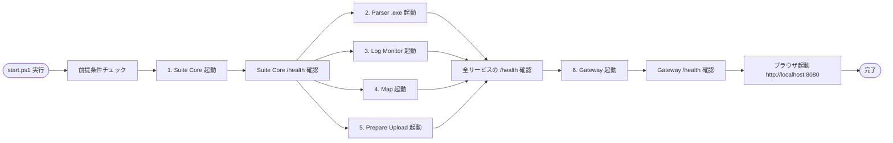

# 06. 起動・デプロイ方針

## 1. 概要

### スコープ

- Windows ローカルでの個人運用
- ワンクリック（または1コマンド）で全プロセスを起動できること
- 開発時はホットリロードで快適に作業できること

### 起動対象（合計 6 プロセス）

| # | プロセス | 種別 | ポート | 起動コマンド（概要） |
|---|---|---|---|---|
| 1 | Replay Parser | .NET 9 (exe) | 12345 | `dotnet run --project services/replay_parser` |
| 2 | Log Monitor | FastAPI (Python) | 8000 | `uvicorn app.main:app --port 8000`（cwd: `services/log_monitor_api`） |
| 3 | Map | FastAPI (Python) | 8001 | `uvicorn app.main:app --port 8001`（cwd: `services/map_api`） |
| 4 | Prepare Upload | FastAPI (Python) | 8002 | `uvicorn app.main:app --port 8002`（cwd: `services/prepare_upload_api`） |
| 5 | Suite Core | FastAPI (Python) | 8003 | `uvicorn app.main:app --port 8003`（cwd: `services/suite_core`） |
| 6 | API Gateway | FastAPI (Python) | 8080 | `uvicorn gateway.app.main:app --port 8080` |

フロント（React）は本番時は Gateway が配信、開発時は Vite dev (`:5173`) で別途起動。

---

## 2. 起動方式の比較

### 2.1 .bat / start.cmd

| 項目 | 評価 |
|---|---|
| 並行起動 | `start "" cmd /c ...` で疑似的に可。各々別ウィンドウになり管理が雑然 |
| ヘルスチェック | 不可（ループ + curl 風記述は冗長） |
| Ctrl+C 終了 | 子プロセスにシグナルが届きにくい |
| ログ集約 | 各ウィンドウに散らばる |

→ 個人ツール初期段階の暫定としては可。本格運用には不向き。

### 2.2 PowerShell スクリプト (Start-Process)

| 項目 | 評価 |
|---|---|
| 並行起動 | `Start-Process` + `-WindowStyle Hidden` で背景起動 |
| ヘルスチェック | `Invoke-WebRequest` で polling 可能、ループ制御は素直 |
| Ctrl+C 終了 | スクリプト自体で trap して `Stop-Process` を呼べる |
| ログ集約 | `-RedirectStandardOutput / -RedirectStandardError` でファイル出力可 |
| Windows 標準 | OS 同梱、追加インストール不要 |

### 2.3 honcho / overmind / foreman

| 項目 | 評価 |
|---|---|
| Procfile 簡潔 | ◎ 6 行で済む |
| ログ集約 | ◎ 自動で色分け表示 |
| 起動順序 | △ honcho では順序保証なし、`overmind` は依存定義可だが Win 対応が弱い |
| ヘルスチェック | × 自前実装が必要 |
| Win サポート | △ honcho は Python 依存（既に必須）。overmind は Linux 中心 |

### 2.4 docker-compose

| 項目 | 評価 |
|---|---|
| 起動順序 | ◎ `depends_on` + `healthcheck` |
| ログ集約 | ◎ |
| Win 起動 | × Docker Desktop 必須（リソース重、ライセンス考慮） |
| ファイル直接アクセス | △ ボリュームマウントが必要、Windows パスで煩雑 |

→ 個人ローカル用途には**過剰**かつ前提が重い。不採用。

### 2.5 Python スクリプト (subprocess.Popen / multiprocessing)

| 項目 | 評価 |
|---|---|
| 並行起動 | ◎ |
| ヘルスチェック | ◎ httpx で柔軟に書ける |
| Ctrl+C 終了 | ○ シグナルハンドラ実装可 |
| ログ集約 | ○ 自前で色付け / ファイル出力可 |
| 弱点 | Python ランタイムが先に動いている必要があるが、Python サービスが多数あるためどのみち必須 |

### 2.6 比較マトリクス

| 方式 | 並行起動 | ヘルスチェック | ログ集約 | Win 起動 | Ctrl+C | 学習コスト | 採用 |
|---|---|---|---|---|---|---|---|
| .bat | △ | × | × | ◎ | × | ◎ | × |
| PowerShell | ○ | ○ | ○ | ◎ | ○ | ○ | **◎ (主)** |
| honcho | ○ | × | ◎ | ○ | ○ | ○ | △（補助） |
| docker-compose | ◎ | ◎ | ◎ | × | ○ | △ | × |
| Python script | ◎ | ◎ | ○ | ○ | ○ | △ | **○ (補助)** |

---

## 3. 推奨案: PowerShell スクリプト + Python ヘルパー

### 構成

- **`start.ps1`**: 全プロセスを `Start-Process -WindowStyle Hidden` で背景起動、ログを `logs/` に出力、PID を `.run/pids.json` に記録
- **`scripts/healthcheck.py`**: 各サービスの `/health` を polling、全 up になるまで待つ（タイムアウト 30 秒）
- **`stop.ps1`**: `.run/pids.json` から PID を読み、`Stop-Process` で順次終了

### 選定根拠

1. **Windows 標準環境で完結**: PowerShell は OS 同梱、Python は Python サービスのために既に必須
2. **ヘルスチェック付き起動**: PowerShell から `python scripts/healthcheck.py` を呼び、全サービス up を確認してから Gateway を起動 + ブラウザ起動
3. **ログ集約が現実的**: `Start-Process` の `-RedirectStandardOutput` で各サービスのログを `logs/<service>.log` に分離保存。tail 表示は別途 `Get-Content -Wait`
4. **シンプル**: 追加ツール不要、デバッグ時は個別サービスを単体起動可能

### 採用しない方式の理由

| 方式 | 不採用の主な理由 |
|---|---|
| .bat | ヘルスチェック・Ctrl+C・ログ集約のいずれも不便 |
| docker-compose | Docker Desktop の重さが個人ツール用途に見合わない |
| honcho 単独 | ヘルスチェック・起動順序の制御に追加スクリプトが必要 → 結局 Python が必要 |
| Python 単独 | PowerShell と比べ「短い起動スクリプト」のメリットが薄れる。ただしヘルパーとしては併用 |

---

## 4. 起動シーケンス

### 4.1 起動順序



### 4.2 起動順序の根拠

1. **Suite Core を最優先**: 設定ファイル（`~/.fortnite-suite/config.json`）の読み込みと、他サービスから参照される `GET /api/config` を即時提供できるようにする
2. **Parser・Log Monitor・Map・Upload は並行起動**: 互いに依存しない（Map → Parser の依存はリクエスト時のみ）
3. **Gateway は最後**: 上流が起動していない状態で Gateway を起動するとフロント側で 503 が頻発する。`/health` で確認後に上げる

### 4.3 起動完了判定

各サービスは `GET /api/health`（または gateway 自身は `GET /health`）を実装する。`scripts/healthcheck.py` が以下のロジックで polling:

```python
# 擬似コード — 実装は scripts/smoke.py
TARGETS = {
    "replay_parser":      "http://127.0.0.1:12345/health",
    "log_monitor_api":    "http://127.0.0.1:8000/health",
    "map_api":            "http://127.0.0.1:8001/health",
    "prepare_upload_api": "http://127.0.0.1:8002/health",
    "suite_core":         "http://127.0.0.1:8003/health",
}

def wait_until_ready(timeout_sec=30):
    deadline = time.monotonic() + timeout_sec
    pending = dict(TARGETS)
    while pending and time.monotonic() < deadline:
        for name, url in list(pending.items()):
            try:
                r = httpx.get(url, timeout=2)
                if r.status_code == 200:
                    print(f"  ✅ {name}")
                    pending.pop(name)
            except Exception:
                pass
        if pending:
            time.sleep(0.5)
    return list(pending.keys())  # 残ったもの = 失敗
```

### 4.4 起動失敗時の挙動

| 失敗箇所 | 挙動 |
|---|---|
| Suite Core | start.ps1 を中断、エラー表示。設定ファイル破損が主な原因 → ログ参照を促す |
| Parser (.NET) | 警告のみ、Gateway は起動。Parser 機能はフロント側で 503 表示 |
| Log Monitor | 警告のみ、Gateway は起動。「Fortnite ステータス」が unavailable 表示 |
| Map / Upload | 警告のみ、Gateway は起動。該当ページで 503 |
| Gateway | start.ps1 を中断、エラー表示。ブラウザは起動しない |

→ **個別サービスの失敗で全体停止しない**。フロントが個別エラーを表示できる構造（`useGatewayHealth()`）と整合。

---

## 5. 終了方式

### 5.1 まとめて停止

`stop.ps1` の流れ:
1. `.run/pids.json` から PID 一覧を読み込み
2. **Gateway を最初に停止**（フロントへのアクセスを切る）
3. 上流サービスを順に `Stop-Process -Id <pid> -Force`
4. PID ファイルを削除

```powershell
# 擬似コード
$pids = Get-Content .run\pids.json | ConvertFrom-Json
Stop-Process -Id $pids.gateway -Force -ErrorAction SilentlyContinue
foreach ($svc in @("parser","log_monitor","map","prepare_upload","suite_core")) {
    Stop-Process -Id $pids.$svc -Force -ErrorAction SilentlyContinue
}
Remove-Item .run\pids.json
```

### 5.2 Ctrl+C ハンドリング

`start.ps1` をアタッチドモード（ログを tail 表示しながら走らせる）で実行する場合、Ctrl+C で全停止できるよう `trap` で `stop.ps1` を呼ぶ:

```powershell
trap { & .\stop.ps1; exit }
```

「バックグラウンドで起動して終了」モード（既定）と「アタッチして tail」モード（`-Attach` フラグ）を `start.ps1` に持たせる。

### 5.3 残留プロセスの掃除

万一 `stop.ps1` 失敗 / クラッシュ等で PID ファイルと実プロセスが食い違った場合のために、ポート番号で殺す補助スクリプト `scripts/kill_by_port.ps1`:

```powershell
# 擬似コード — 実装は scripts/kill_by_port.ps1
$ports = @(8000, 8001, 8002, 8003, 8080, 12345)   # LogMon, Map, Upload, SuiteCore, Gateway, Parser
foreach ($p in $ports) {
    $conn = Get-NetTCPConnection -LocalPort $p -ErrorAction SilentlyContinue
    if ($conn) { Stop-Process -Id $conn.OwningProcess -Force }
}
```

通常運用では使わない（フォールバック）。

---

## 6. ログ集約

### 6.1 各サービスの stdout/stderr

`Start-Process` の `-RedirectStandardOutput` / `-RedirectStandardError` で個別ファイルに書き出す:

```
logs/
├── suite_core.out.log
├── suite_core.err.log
├── parser.out.log
├── parser.err.log
├── log_monitor.out.log
├── log_monitor.err.log
├── map.out.log
├── map.err.log
├── prepare_upload.out.log
├── prepare_upload.err.log
├── gateway.out.log
└── gateway.err.log
```

### 6.2 起動セッション全体ログ

`start.ps1` 自身のログ（起動順序・ヘルスチェック結果）は `logs/startup.log` に追記。

### 6.3 tail 表示

開発時に複数サービスのログを横並びで見たい場合:
- 標準: `Get-Content logs\map.out.log -Wait`
- 複数まとめて: 補助スクリプト `scripts/tail_all.ps1` で `Start-Job` を 6 個張って色分け表示

### 6.4 ローテーション方針

- 個人ツール、トラフィック微小なため**自動ローテーションは導入しない**
- `start.ps1` 起動時に `logs/*.log` を `logs/archive/<日付>/` に退避（任意、設定可能）
- 古いログの削除はユーザ手動

---

## 7. 開発時 vs 本番時の違い

### 7.1 開発時

| 要素 | 内容 |
|---|---|
| バックエンド | `dev.ps1` で `uvicorn ... --reload` で各サービス起動（ホットリロード） |
| フロント | `cd frontend && npm run dev`（Vite dev、`:5173`） |
| Vite proxy | `/api/*` を `:8080` に転送（gateway も起動しておく） |
| ブラウザ | `http://localhost:5173`（Vite） |
| .NET Parser | 開発時も `Fortnite_Replay_Parser_GUI.exe` を起動（ASP.NET の watch は使わない、変更頻度低） |

### 7.2 本番時

| 要素 | 内容 |
|---|---|
| バックエンド | `start.ps1` で全サービスを reload なし起動 |
| フロント | `npm run build` 済みの `frontend/dist/` を Gateway が配信 |
| ブラウザ | `http://localhost:8080` |

### 7.3 ハイブリッド（推奨される日常デバッグ）

- バックエンド: `start.ps1`（reload なし、安定）
- フロント: `npm run dev`（ホットリロード）
- Vite が `/api/*` を `:8080` (Gateway) に転送するので、ブラウザは `:5173` に接続するだけで本番と同じ挙動を確認できる

---

## 8. ビルド方針

### 8.1 .NET (Replay Parser)

```powershell
cd Integrated_App\services\replay_parser  # 既存 Fortnite_Replay_Parser_GUI を取り込んだ場所
dotnet publish -c Release -o ..\..\dist\replay_parser
```

成果物: `Integrated_App\dist\replay_parser\Fortnite_Replay_Parser_GUI.exe`（依存 dll 含む自己完結）

### 8.2 Python (4 サービス + Gateway)

各サービスに `pyproject.toml` または `requirements.txt` を配置。共通の venv を 1 つ使う方針:

```powershell
# setup.ps1 で実行
python -m venv .venv
.\.venv\Scripts\Activate.ps1
pip install -r services\requirements.txt   # 全サービス共通の依存をまとめる
```

### 8.3 Frontend

```powershell
cd Integrated_App\frontend
npm ci
npm run build
```

成果物: `Integrated_App\frontend\dist\`（Vite の既定）

### 8.4 ビルド成果物の配置

```
Integrated_App/
├── dist/
│   └── replay_parser/        # .NET publish 成果物
├── frontend/
│   └── dist/                 # Vite ビルド成果物（Gateway が配信）
└── .venv/                    # Python 共通仮想環境
```

詳細なディレクトリ構成は `07_project_structure.md`。

---

## 9. 初回セットアップ

### 9.1 前提条件チェック

`setup.ps1` の冒頭で確認:

| ツール | 確認方法 | 必須/任意 |
|---|---|---|
| .NET 9 SDK | `dotnet --version` で 9.x | 必須 |
| Python 3.11+ | `python --version` | 必須 |
| Node.js 20+ | `node --version` | 必須 |
| ffmpeg / ffprobe | `ffmpeg -version` / `ffprobe -version` | 任意（Prepare Upload のみ必要、未検出時は機能無効） |
| OBS Studio | （手動確認） | 任意（OBS 連携機能のみ） |

不足があれば**インストール案内 URL** を表示して終了。

### 9.2 依存インストール

`setup.ps1`:
```powershell
# 擬似コード
1. 前提条件チェック
2. Python venv 構築 + pip install
3. npm ci
4. dotnet publish
5. logs/ ディレクトリ作成
6. .run/ ディレクトリ作成
7. ~/.fortnite-suite/ ディレクトリ作成
8. config.json の雛形を生成（存在しない場合のみ）
```

### 9.3 設定ファイル初期化

`~/.fortnite-suite/config.json` の雛形:
```json
{
  "user_player_id": "",
  "demos_dir": "%LOCALAPPDATA%\\FortniteGame\\Saved\\Demos",
  "obs_recording_dir": "%USERPROFILE%\\Videos",
  "log_path": "%LOCALAPPDATA%\\FortniteGame\\Saved\\Logs\\FortniteGame.log"
}
```

`%XXX%` は Suite Core 起動時に展開（クロスマシン互換のため）。

`user_player_id` が空のままなら、初回ブラウザ起動時に `<SetupPage />`（`05` §3.1）が強制表示される。

### 9.4 OBS 設定

`__Individual_Apps/fortnite_log_monitor/.env` の内容を `Integrated_App/services/log_monitor_api/.env` にコピーする手順を `setup.ps1` で案内（または対話入力）。

---

## 10. ショートカット作成

### 10.1 デスクトップショートカット

`setup.ps1` の最終ステップで提案（インタラクティブに「作成しますか? Y/N」）:

```powershell
# 擬似コード
$shell = New-Object -ComObject WScript.Shell
$lnk = $shell.CreateShortcut("$env:USERPROFILE\Desktop\Fortnite Suite.lnk")
$lnk.TargetPath = "powershell.exe"
$lnk.Arguments = "-NoProfile -ExecutionPolicy Bypass -File `"$PSScriptRoot\start.ps1`""
$lnk.WorkingDirectory = $PSScriptRoot
$lnk.IconLocation = "$PSScriptRoot\assets\icon.ico"
$lnk.Save()
```

### 10.2 ブラウザ自動起動

`start.ps1` の末尾でデフォルトブラウザを開く:
```powershell
Start-Process "http://localhost:8080"
```

`-NoBrowser` フラグでスキップ可能（CI / バックグラウンド起動用途）。

---

## 11. スクリプト雛形（擬似コード）

### 11.1 `setup.ps1`（初回）

```powershell
# 擬似コード（実装は別途）
param([switch]$SkipChecks)

Write-Host "==> Prerequisite check"
if (-not $SkipChecks) {
    Assert-DotNet9
    Assert-Python311
    Assert-Node20
    Warn-IfMissing-Ffmpeg
}

Write-Host "==> Python venv"
python -m venv .venv
.\.venv\Scripts\python -m pip install --upgrade pip
.\.venv\Scripts\pip install -r services\requirements.txt

Write-Host "==> npm install"
Push-Location frontend
npm ci
Pop-Location

Write-Host "==> .NET publish"
Push-Location services\replay_parser
dotnet publish -c Release -o ..\..\dist\replay_parser
Pop-Location

Write-Host "==> Initialize directories"
New-Item -ItemType Directory -Path logs, .run -Force | Out-Null
$cfgDir = "$env:USERPROFILE\.fortnite-suite"
New-Item -ItemType Directory -Path $cfgDir -Force | Out-Null
if (-not (Test-Path "$cfgDir\config.json")) {
    Copy-Item assets\config.template.json "$cfgDir\config.json"
}

Write-Host "==> Done. Run start.ps1 to launch."
```

### 11.2 `start.ps1`（日常起動）

```powershell
# 擬似コード
param(
    [switch]$Attach,       # ログを tail 表示しながら走らせる
    [switch]$NoBrowser     # ブラウザを開かない
)

$Root = $PSScriptRoot
$Logs = "$Root\logs"
$Run  = "$Root\.run"
$Venv = "$Root\.venv\Scripts"

# ----- 1. Suite Core を先に起動 -----
$pids = @{}
$pids.suite_core = (Start-Process "$Venv\python.exe" `
    -ArgumentList "-m","uvicorn","suite_core.main:app","--host","127.0.0.1","--port","8000" `
    -WorkingDirectory "$Root\services" `
    -WindowStyle Hidden `
    -RedirectStandardOutput "$Logs\suite_core.out.log" `
    -RedirectStandardError  "$Logs\suite_core.err.log" `
    -PassThru).Id

Wait-Until-Healthy "http://127.0.0.1:8000/api/health" 10

# ----- 2. 残り 4 サービスを並行起動 -----
$pids.parser         = Start-PythonOrExe "parser"
$pids.log_monitor    = Start-PythonOrExe "log_monitor"
$pids.map            = Start-PythonOrExe "map"
$pids.prepare_upload = Start-PythonOrExe "prepare_upload"

# ----- 3. ヘルスチェック -----
$failed = & "$Venv\python.exe" "$Root\scripts\healthcheck.py" --timeout 30
if ($failed) {
    Write-Warning "起動に失敗したサービス: $failed"
}

# ----- 4. Gateway 起動 -----
$pids.gateway = (Start-Process "$Venv\python.exe" `
    -ArgumentList "-m","uvicorn","gateway.main:app","--host","127.0.0.1","--port","8080" `
    -WorkingDirectory "$Root\services" `
    -WindowStyle Hidden `
    -RedirectStandardOutput "$Logs\gateway.out.log" `
    -RedirectStandardError  "$Logs\gateway.err.log" `
    -PassThru).Id

Wait-Until-Healthy "http://127.0.0.1:8080/health" 10

# ----- 5. PID 記録 -----
$pids | ConvertTo-Json | Out-File "$Run\pids.json" -Encoding UTF8

# ----- 6. ブラウザ起動 -----
if (-not $NoBrowser) {
    Start-Process "http://localhost:8080"
}

# ----- 7. アタッチモード -----
if ($Attach) {
    trap { & "$Root\stop.ps1"; exit }
    Get-Content "$Logs\gateway.out.log" -Wait
}
```

### 11.3 `stop.ps1`

```powershell
# 擬似コード
$Run = "$PSScriptRoot\.run"
if (-not (Test-Path "$Run\pids.json")) {
    Write-Host "実行中のプロセスはありません"; exit
}
$pids = Get-Content "$Run\pids.json" | ConvertFrom-Json

# Gateway を先に止める
Stop-Process -Id $pids.gateway -Force -ErrorAction SilentlyContinue

# 上流を順に止める
foreach ($svc in @("parser","log_monitor","map","prepare_upload","suite_core")) {
    Stop-Process -Id $pids.$svc -Force -ErrorAction SilentlyContinue
}
Remove-Item "$Run\pids.json" -Force
Write-Host "停止しました"
```

### 11.4 `dev.ps1`（開発時）

```powershell
# 擬似コード
# バックエンドは start.ps1 を NoBrowser で起動（reload なし、安定）
& "$PSScriptRoot\start.ps1" -NoBrowser

# フロントは Vite dev で別ウィンドウ起動
Start-Process powershell -ArgumentList @(
  "-NoProfile","-NoExit","-Command","cd $PSScriptRoot\frontend; npm run dev"
)

Write-Host "Backend: http://localhost:8080"
Write-Host "Frontend (dev): http://localhost:5173"
```

オプションとして「特定サービスだけ `--reload` で起動」する `dev-svc.ps1 <service-name>` を別途用意。

---

## 12. トラブルシュート

### 12.1 ポート衝突

| 症状 | 対処 |
|---|---|
| `start.ps1` 起動失敗、ログに "address already in use" | `scripts\kill_by_port.ps1` で該当ポートを掴むプロセスを停止 |
| 12345 が他アプリで使用中 | Parser のポート変更は .NET コード修正が必要（`Program.cs:117`）。緊急時の回避手段として記載のみ、通常は別アプリの停止で対応 |

### 12.2 上流サービス起動失敗

| 症状 | 対処 |
|---|---|
| ヘルスチェックでタイムアウト | `logs/<svc>.err.log` を確認。Python 例外なら依存欠落、.NET 例外なら .NET ランタイム未インストール |
| Suite Core が config.json 読み込みエラー | `~/.fortnite-suite/config.json` の JSON 構文を確認。破損していれば `assets/config.template.json` から復元 |

### 12.3 ffmpeg 未検出

- Prepare Upload の `/api/health` が `{ "ffmpeg": { "available": false } }` を返す
- フロントで「Prepare Upload は ffmpeg が見つからないため使用できません」表示
- 対処: ffmpeg を [公式](https://ffmpeg.org/download.html#build-windows) からダウンロード、`PATH` に追加して再起動

### 12.4 Fortnite ログパス未検出

- Log Monitor 起動時に `find_fortnite_log()` が None を返す
- フロントで「Fortnite ログファイルが見つかりません」表示
- 対処: 設定ページで `log_path` を手動入力 → PUT /api/config → Log Monitor サービスを `stop.ps1 + start.ps1` で再起動

### 12.5 フロントから 503 が頻発

- 起因サービスを `gateway /health` で特定
- 該当サービスのログを確認、必要なら個別再起動（`stop.ps1` + `start.ps1` 全体、または PID 直指定で当該プロセスのみ起動）

### 12.6 Match 詳細で人間/Bot 数が空のまま

- `/api/suite/matches/{id}` は replay_parser の `/api/replay-to-json` を後追いで呼ぶ構成
- Replay が巨大（200MB 超）/破損している場合、JSON 生成に失敗して `replay_summary` が null
- 対処: `logs/replay_parser.err.log` を確認。`FortniteReplayReader` の例外なら Fortnite バージョン追従待ち
- UI 側は null を許容して「試合情報」のみ表示する（他ページは影響なし）

### 12.7 ログ監視トグルが残ったまま切り替わらない

- `/api/log-monitor/status` がサーバ真実、フロントのトグルは状態の投影
- サービス再起動後はブラウザをリロードすると整合する
- `stop.ps1` 中に SSE が切れると、稀にトグル UI が ON のまま残る → ページ移動 or リロードで解消

### 12.8 Prepare Upload の `/health` と `/api/health` は別物

- `/health` は**死活**（`{status, service, ts}`）
- `/api/health` は **ffmpeg/ffprobe 検出結果**（`{ffmpeg: {...}, ffprobe: {...}}`）
- フロント実装時に混同しやすい。Gateway 経由でも同様 (`/api/prepare-upload/health` vs `/api/prepare-upload/api/health`)

### 12.9 OBS WebSocket 未接続時の挙動

- `suite_core` 起動時に `obsws_python` で `GetRecordDirectory` を試行、失敗時は 2 秒でタイムアウト
- `obs_recording_dir` は `config_file` → `default (%USERPROFILE%/Videos)` の順にフォールバック
- `/settings` の取得元バッジで現在のソースが確認できる
- OBS を後から起動しても自動再接続はしない → サービス再起動で再検出させる

---

（本ドキュメントここまで）
